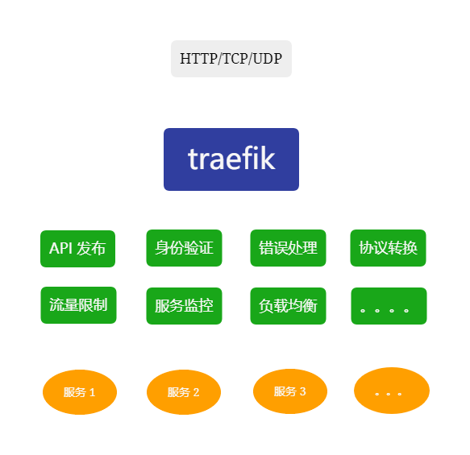

    
# Traefik Proxy


## 什么是 Traefik Proxy

官网介绍 Traefik Proxy

> Traefik is an open-source Edge Router that makes publishing your services a fun and easy experience. It receives requests on behalf of your system and finds out which components are responsible for handling them.

大概意思是：

Traefik 是一个开源的边缘路由，以更加友好的方式发布服务。它可以接受请求并决定交给系统的哪些服务进行处理。

作为系统服务的唯一入口，它可以很好的封装系统的内部结构，对外提供统一的 API。除此之外，也可以提供身份验证、响应错误处理、协议转换、限流和监控等额外功能。



- API 发布（路由功能），是 Traefik 的核心功能。通过路由功能将请求转发到相应的系统服务处理。

- 身份验证，统一的身份验证，从各单体服务中抽离认证逻辑，从而更关注自身的业务逻辑。

- 协议转换，通过将使用不同技术（例如：RESTFUL, GraphQL）的各个服务进行整合，统一对外提供标准 API 服务。对于异构的系统特别友好，前端可以统一 API。

- 错误处理，对于异常或瘫痪的服务进行故障处理，例如返回统一的错误页面。

- 流量限制，对 API 的访问进行限制，防止各项服务因超过处理能力而瘫痪，还可以防止部分网络攻击。

- 服务监控，统一的日志记录和收集，监控前后端流量，各项服务健康状态。

- 负载均衡，通过轮询，指定权重，IP 哈希值等机制分散下游服务器的负载。

- 灰度发布，根据请求中的特殊标记和服务列表元数据表述进行流量控制，实现无感知的灰度发布。

## 与 Nginx 比较

Nginx 是一款高性能的 HTTP 和反向代理的服务器软件。即可作为静态资源服务器，也可作为反向代理服务器。

与 Traefik 相比，Nginx 作为服务入口最大的劣质，是不支持自动服务发现，新上线或更新后的服务无法实时更新，需要手动执行 reload。

## 搭建一个 Traefik 服务（docker）

> Traefik 版本：2.7.0-rc1

### 核心概念

- Providers，自动发现平台的服务，可以是容器编排工具，容器引擎或 K-V 存储等，如 docker, k8s, file...

- EntryPoints，网络入口，定义接收请求的监听端口。

- Routers，路由规则，根据所匹配的规则转发到相应的 service。

- Services，应用服务，实际提供服务的应用实体，最终负责处理请求。

- Middlewares，中间件，在转发到对应 service 前，对请求做预处理。

> 当启动 Traefik 后，会监听配置的网络入口（EntryPoints）和自动发现（Providers）应用服务。当接收到请求后，会去寻找匹配的路由规则（Routers）并经过中间件（Middlewares）的处理，转发到应用服务（Services）。

Traefik 的配置分为 静态配置 和 动态配置 两种。

静态配置是 Traefik 自身的配置，如监听请求的端口、自动服务发现等。

动态配置是 Traefik 所代理的服务的一些设定，如请求中间件，SSL 证书等。

### 静态配置

#### EntryPoints

配置监听 HTTP 请求和 HTTPS 请求的入口

```toml
[entryPoints]
  [entryPoints.http]
    address = ":80"
  [entryPoints.tls]
    address = ":443"
```

#### Providers

配置自动发现 docker 的服务

```toml
[providers]
  # Docker server endpoint. Can be a tcp or a unix socket endpoint.
  [providers.docker]
    watch = true
    # Expose containers by default in traefik
    # if false, the docker image should add label `traefik.enable=true` to be found
    exposedByDefault = false
    endpoint = "unix:///var/run/docker.sock"
    network = "traefik_network"
```

#### 开启 Dashboard

Traefik 自带 Dashboard

```toml
[api]
  # Enabled Dashboard
  dashboard = true
  # Enable the API in insecure mode
  insecure = false # 生产环境不建议启用
```

如果关闭 insecure，需要手动配置路由

```toml
[http.routers]
  [http.routers.gateway]
    rule = "Host(`gateway.xxx.com`)"
    service = "api@internal" # dashboard 的内置服务名
```

### 配置 HTTP 服务

配置一个简单的 HTTP 服务

至少需要以下配置：

- 路由规则
- 服务名，可以手动配置 或 自动发现

```toml
# 手动配置 service
[http.services]
  [http.services.api.LoadBalancer]
    [[http.services.api.LoadBalancer.servers]]
      url = "http://api-service:8080"

[http.routers]
  [http.routers.api]
    rule = "Host(`api.xxx.com`)" # 路由规则
    service = "api@file" # 服务名 
```

配置监听端口

```toml
[http.routers]
  [http.routers.api]
    entryPoints = ["http", "tls"]
    rule = "Host(`api.xxx.com`)"
    service = "api@file"
```

配置基本验证中间件

```toml
[http.middlewares.auth.basicAuth]
  users = [
    "admin:password" # 使用 htpasswd 生成密码
  ]

[http.routers]
  [http.routers.api]
    entryPoints = ["http", "tls"]
    rule = "Host(`api.xxx.com`)"
    service = "api@file"
    middlewares = ["auth"]
```

配置证书服务

```toml
[http.routers]
  [http.routers.api]
    entryPoints = ["http", "tls"]
    rule = "Host(`api.xxx.com`)"
    service = "api@file"
    middlewares = ["auth"]
    [http.routers.api.tls]
      certResolver = "default" # 配置证书 resolver，该 resolver 需要是静态配置中已配置
```

在静态配置中配置证书 resolver，采用 tls challenge 方式

```toml
[certificatesResolvers.default.acme]
  email="xxxx@xxx.com"
  storage = "/data/cert/default.json" # 保存证书的路径
  [certificatesResolvers.default.acme.tlschallenge]
```

### 配置 TCP 服务

配置 TCP 服务跟 HTTP 服务差不多，也需要路由、服务（手动、自动发现）

```toml
[tcp.services]
  [tcp.services.postgresql.loadBalancer] # 添加 postgresql 服务
    [[tcp.services.postgresql.loadBalancer.servers]]
      address = "app-postgresql:5432"

[tcp.routers]
  [tcp.routers.postgresql] # 添加 TCP 路由
    entryPoints = ["db"] # 监听端口
    rule = "HostSNI(`*`)" # 将所有 TCP 流量转发到服务
    service = "postgresql@file"
```

参考资料

[traefik 官网](https://doc.traefik.io/traefik/)

[微服务网关对比和选型：Zuul、Spring Cloud GetWay、Kong和Traefik](https://juejin.cn/post/7063244165538119710)

[一文搞懂 Traefik2.1 的使用](https://www.qikqiak.com/post/traefik-2.1-101/)

      