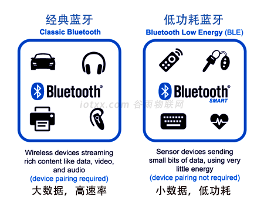
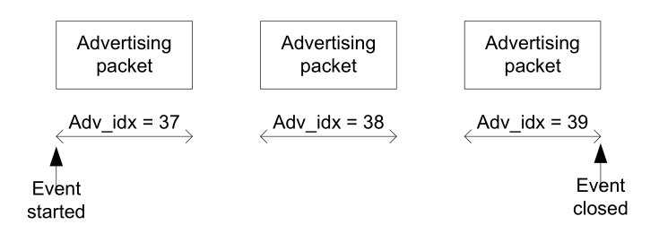
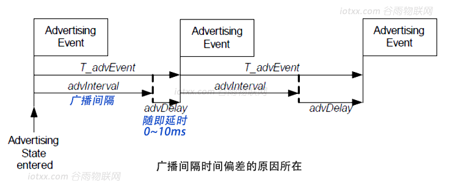
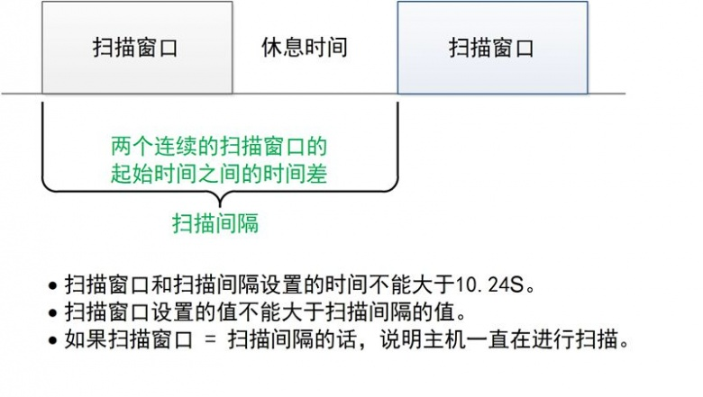

    
<small color="#ccc">last modified at 2023/12/7 8:49:38</small>
# Bluetooth Low Energy

`BLE 是低功耗蓝牙的英文缩写，是蓝牙4.0版本开始支持的技术规范`

## 什么是蓝牙

蓝牙是一种**近距离无限通信**技术，运行在 __2.4GHz__ 的免费频段

蓝牙4.0以后分为两种模式：

- 单模蓝牙，即低功耗蓝牙，低功耗，快连接，长距离

- 双模蓝牙，支持低功耗蓝牙和传统蓝牙，经典蓝牙（大数据高速率，应用在音视频等传输中）

传统蓝牙支持音频（HFP/HSP, A2DP）和数据（SPP, HID等）两大类协议



## BLE 的特点

低功耗蓝牙瞄准 智能终端、智能家居、物联网等领域，具备以下主要特点：

- 低功耗，使用纽扣电池可运行数月至数年

- 快连接，毫秒级连接速度，传统蓝牙可达数分钟

- 远距离，可达数百米的通信距离，传统蓝牙通常在 10 米左右

蓝牙联盟为 BLE 定义了一系列的标准 `Profile`,可理解为数据规范。只要遵守该规范，蓝牙设备均可以相互连接与通信。

BLE 支持的标准 Profile 有：

- HID，用于无线鼠标、键盘或其他遥控设备

- BatteryServices，电池状态服务，用于告知电池电量状态

- HRP，心率计，用于心率采集等

- 自定义 Profile，扩展应用领域

`低功耗蓝牙的 Profile 均基于 GATT 之上，如HID over GATT。传统蓝牙中的 HID 规范与低功耗蓝牙中的 HID 规范用的是两个不同的通道。`

## BLE 中一些概念

### 角色

BLE 设备主要分为

- 主机（Master/Central），发起对从机的扫描，如手机

- 从机（Slave/Peripheral），广播并等待主机连接，如智能手环

- 观察者（Observer），监听空中的广播，只能持续扫描从机，不能发起连接

- 广播者（Broadcaster），持续广播，不能被连接

### 广播

广播是指**从机**没经过一个时间间隔发送一次**广播数据包**，改时间间隔称为**广播间隔**，该发送行为称为**广播事件**，只有从机处于广播状态时，主机才能发现

每个广播事件中，广播包会分别在 **37，38和39** 三个信道上**依次**广播



广播的时间间隔范围从 20ms 到 10.24s，另外 BLE 链路层会在两个广播事件之间添加 0~10ms 的随机延时，保证多个设备广播时不会碰撞



蓝牙 4.0 中广播数据包最多能携带 31bytes 的数据

当主机收到从机的广播，可发送获取更多数据包请求，从机将广播**扫描回应**数据包

`蓝牙 4.x，广播有效载荷最多是 31bytes。而在蓝牙 5.0 中，通过添加额外的广播信道和新的广播 PDU，将有效载荷增加到了 255 bytes`

### 扫描

扫描（scan）是主机**监听**从机广播和**发送**扫描请求的过程

通过扫描，主机可以获得

- 从机的广播
- 扫描回应广播
- 对已扫描到的从机发起连接

两个重要的时间参数，**扫描窗口**和**扫描间隔**



- 被动扫描，主机监听广播，当接收到广播时，协议栈向上层（应用层）传递广播包

- 主动扫描，除完成被动扫描动作外，还会向从机发送扫描请求，从机接收后，会再次发送扫描回应广播

### 连接

两个设备在**特定时间、特定频道*上彼此发送/接收数据 - 跳频连接

稍后设备在特定通道和特定时间相遇，称为连接事件。如没有需要发送/接收的数据，则交换链路层数据来维护连接。


#### 连接参数

- 连接间隔（Connection Interval），两个连接事件之间的时间差称为连接间隔，以 1.25ms 为单位，范围在 7.5ms ~ 4.0s

- 从机延迟（Slave Latency），可以跳过的最大事件数。如果从机没有要发送的数据，则可以跳过连接事件，继续保持睡眠节省电量

- 有效连接间隔，Effective Connection Interval = (Connection Interval) × (1 + [Slave Latency])

- 监控超时（Supervision Time-out），两次成功连接事件的最大时间间隔，如无成功事件，设备将终止连接并返回未连接状态。以 10ms 为单位，范围在 10（100ms）~ 3200（32.0s），须大于连接间隔

#### 连接参数更新请求

连接参数有主机发起连接时提供，如从机有对连接参数的要求，可发起连接参数更新请求。建议在建议连接后 5s 左右再发起，可修改连接参数

#### 连接参数的优化考量

| 影响 | 减少间隔 | 增加间隔 | 减少延迟 | 增加延迟 |
| -: | :-: | :-: | :-: | :-: |
| 功耗 | + | - | + | - |
| 吞吐量 | + | - |
| 发送时间 | - | + | - | + |

### 通信

从机具有的数据或属性特征，称为 Profile

从机中添加 Profile，作为 GATT 的 Server 端，主机作为 GATT 的 Client 端

Profile 包含一个或多个 Service，每个 Service 包含一个或多个 Characteristic。主机可发现和获取从机的 Service 和 Characteristic，进行通信。**Characteristic 是主从通信的最小单元**

每个 Service 和 Characteristic 有自己的唯一标识 **UUID**，标准 UUID 为 128 位，蓝牙协议栈一般采用 16 位。

每个 Characteristic 有自己的 property，取值有：可读（r）、可写（w）和通知（n）

- 主机可主动向从机读写（read/write）数据
- 从机可主动向主机通知（notify）数据

### 典型从机

<!--  -->

#### 服务 0x180A

0x180A 是蓝牙协议栈的标准服务 UUID，用来描述设备信息（device info）

- 特征值 0x2A24，描述产品型号（model number string），如 DSL-C07
- 特征值 0x2A25，描述产品序列号（serial number string，如 DSL0016190502500269
- 特征值 0x2A26，描述固件版本（firmware version string），如 2.7.2.0

上述特征值是只读属性

#### 服务 0xFFF0

自定义服务 UUID

- 特征值 0xFFF1，自定义数据发送通道，具有 rw 属性。主机可通过该通道向从机发送数据
- 特征值 0xFFF2，自定义数据接收通道，具有 n 属性。从机可以主动向主机发送数据

```c++
// 主机写特征值函数原型
int GATT_WriteCharValue(uuid_t UUID, uint8 *pValue, uint8 len)

// 从机发送通知的函数原型
int GATT_Notification(uuid_t UUID, uint8 *pValue, uint8 len)

// 主机向从机发送 hello
GATT_WriteCharValue(0xFFF1,"Hello",5)

// 从机通知主机 1234
GATT_Notification(0xFFF2,"1234",4)
```

### 断开连接

主机和从机都可以发起断开连接请求，对方收到后会断开连接恢复为未连接状态

      