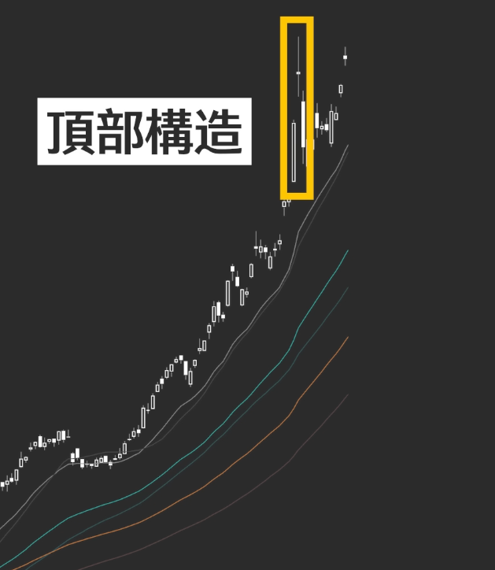

    
# 趋势交易

## 趋势

观察重点：斜率，涨幅/时间，使用对数坐标（百分比）

长期：5年
短期：1年

## 震荡（密集成交区）

- 是在经历较大涨跌幅后的修复阶段。
- 通常对应巨大的筹码峰
- 移动平均线逐渐靠近，密集起来（小于2%），市场成本接近

## 加速上升/下降（斜率接近90°）

- 趋势开始或结束阶段
- 会有两种走法：
  - 快速下降/上升（急涨急跌）
  - 横盘整理，等待放量弥合市场分歧（筹码交换）
- 持续时间短
- 加速前有持仓，没有顶（底）部构造前，不轻易下车
- 能引起均线方向变化的关键波动，可能需要操作

顶（底）部结构

## 稳定上升/下降

- 均线平行移动
- 进入交易：
  - 价格回撤中期均线
  - 底部结构
  - 低一级别多头

<small style={{color: 'grey'}}>last modified at December 13, 2025 23:48</small>

      