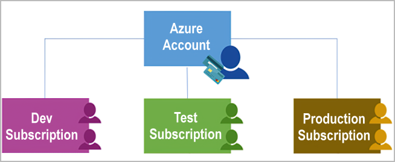
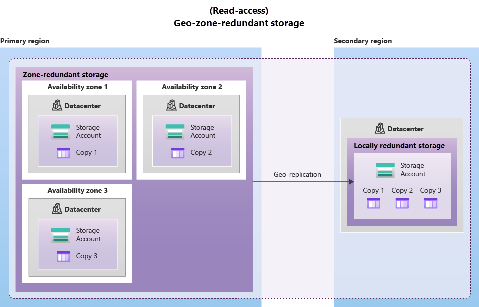

    
# Azure Fundamentals(AZ-900)

Microsoft Azure is a cloud computing platform with an ever-expanding set of services to help you build solutions to meet your business goals.

## Describe cloud concepts

### Cloud computing

Cloud computing is the delivery of computing services over the internet. Computing services include common IT infrastructure such as virtual machines, storage, databases and networking. Cloud services also expand the traditional IT offerings to include things like Internet of Things(IoT), machine learning(ML) and artificial intelligence(AI).

### Shared responsibility model

Start with a traditional corporate datacenter. The company is responsible for maintaining the physical space, ensuring security, and maintaining or replacing the physical devices if anything happens. The IT department is responsible for maintaining all the infrastructure and software needed to keep the datacenter up and running. They are also likely to be responsible for keeping all system patched and on the correct version.

With the shared responsibility model, these responsibilities get shared between the cloud provider and the consumer.

The consumer always be responsible for:

- The information and data stored in the cloud
- Devices that are allowed to connect to the cloud
- The account and identities of the people, devices within your organization

The cloud provider always be responsible for:

- The physical datacenter
- The physical network
- The physical host

The consumer service model determine responsibility for things like:

- Operating system
- Network control
- Applications
- Identity and infrastructure

Shared Responsibility Model

### Cloud models

The cloud models define the deployment type of cloud resource.

- Private cloud, is used by a single entity, provides much greater control for the company ant its IT department, comes with greater cost.
- Public cloud, is built, controlled, and maintained by a third-party cloud provider. Anyone that wants to purchase cloud services can access and use resources.
- Hybrid cloud, is a computing environment that uses both public and private clouds in an inter-connected environment.

_The general availability is a key difference between public and private clouds._

#### Azure Arc

Azure Arc is a set of technologies that helps manage your cloud environment, wether it is a pubic cloud or private cloud, even a multi-cloud environment.

#### Azure VMware Solution

Azure VMware solution lets you run your VMware workload in Azure with seamless integration and scalability.

### Consumption-based model

When comparing IT infrastructure models, there are two types of expenses to consider. Capital expenditure(CapEX) and Operational expenditure(OpEX).

CapEX is typically a one time, upfront expenditure to purchase or secure tangible resources. In contrast, OpEX is spending money on services or product over time.

Cloud computing falls under OpEX because cloud computing operates on a consumption-based model. With cloud computing, you don not pay for the physical infrastructure, the electricity, the security, or anything else associated with maintaining a datacenter.

This consumption-based model has many benefits, including:

- No upfront costs.
- No need to purchase and manage costly infrastructure that users might not use to its fullest potential.
- The ability to pay for more resources when they are needed.
- The ability to stop paying for resources that are no longer needed.

### Benefits of using cloud services

#### High availability

When you are deploying an application, a service, or any IT resources, it is important the resources are available when needed. High availability focuses on ensuring maximum availability, regardless of disruptions or events may occur.

When you are architecting your solution, you will need to account for service availability guarantees.

#### Scalability

Scalability refers to the ability to adjust resources to meet demand.

Scaling generally comes in two varieties:

- Vertical scaling, is focused on increasing or decreasing the capabilities of resources.
- Horizontal scaling, is adding or subtracting the number of resources.

#### Reliability

Reliability is the ability of a system to recover from failures and continue to function

#### Predictability

##### Performance

Performance predictability focuses on predicting the resources needed to deliver a positive experience for your consumer. Autoscaling, load balancing, and high availability are just some of the cloud concepts that support performance predictability. If you suddenly need more resources, autoscaling can deploy additional resources to meet the demand, and then scale back when the demand drops. Or if the traffic is heavily focused on on area, load balancing will help redirect some of the overload to less stressed areas.

##### Cost

Cost predictability is focused on predicting or forecasting the cost of the cloud spend. With the cloud, you can track your resource use in real time, monitor resources to ensure that you are using them in the most efficient way, and apply data analytics to find patterns and trends that help better plan resource deployment.

#### Security and Governance

Whether you are deploying infrastructure as a service or software as a service, cloud features support governance and compliance. Things like set templates help ensure that all your deployed resources meet corporate standards and government regulatory requirement. Plus, you can update all your deployed resources to new standards as standards change.

On the security side, if you want maximum control of security, infrastructure as a service provides you with physical resource but lets you manage the operating systems and installed software, including patches and maintenance. If you want patches and maintenance taken care of automatically, platform as a service or software as a service deployments might be the best cloud strategies for you.

And because the cloud is intended as an over-the-internet delivery of IT resources, cloud providers are typically well suited to handle things like distributed denial of service(DDoS) attacks.

#### Manageability

- Management of the cloud, speaks to managing your cloud resources:
    - Automatically scale resource deployment based on need.
    - Deploy resources based on a pre-configured template, removing the need for manual configuration.
    - Monitor the health of resources and automatically replace failing resources.
    - Receive automatic alerts based on configured metrics, so you are aware of performance in real time.
- Management in the cloud, speaks to how you are able to manage your cloud environment and resources
    - Through a web portal
    - Using a CLI
    - Using APIs
    - Using PowerShell

### Cloud service types

#### Infrastructure as a service (IaaS)

Infrastructure as a service is the most flexible category of cloud services, as it provides you the maximum amount of control for your cloud resources. In an IaaS model, the cloud provider is responsible for maintaining the hardware, network connectivity, and physical security. You are responsible for everything else: operating system installation, configuration, and maintenance; network configuration; database and storage configuration; and so on. With IaaS, you are essentially renting the hardware in a cloud datacenter, but what you do with that hardware is up to you.

#### Platform as a service (PaaS)

Platform as a service is a middle ground between renting space in a datacenter(IaaS) and paying for a complete and deployed solution(SaaS).

Compared with Iaas, you don not have to worry about the licensing or patching for operating system and databases.

#### Software as a service (SaaS)

Software as a service is the most complete cloud service model from a product perspective. With SaaS, you are essentially renting or using a fully developed application. Email, financial software, message application, and connectivity software are all common examples of a SaaS implementation.

While the SaaS model may be the least flexible, it is also the easiest to get up and running. It requires the least amount of technical knowledge or expertise to fully employ

## Describe Azure architecture and services

### [Azure Learn sandbox](https://learn.microsoft.com/en-us/training/modules/describe-core-architectural-components-of-azure/4-exercise-explore-learn-sandbox)

### Azure physical infrastructure

#### Regions

A region is a geographical area on the planet that contains at least one. but potentially multiple datacenters that are nearby and networked together with a low-latency network. When you deploy a resource in Azure, you will often need to choose the region where you want your resource deployed.

> Some services or virtual machine features are only available in certain regions.

#### Availability Zones

Availability zones are physical separate datacenters within an Azure region. Each availability zone is made up of one or more datacenters equipped with independent power, cooling, and networking. An availability zone is set up to be an isolation boundary. If one zone goes down, the other continues working. Availability zones are connected through hight-speed, private fiber-optic networks.

> To ensure resiliency, a minimum of three availability zones are present in all availability zone enabled regions. Currently, no all Azure Regions support availability zones.

You can use availability zones to run mission-critical applications and build high-availability into your application architecture by co-locating your compute, storage, networking, and data resources with in an availability zone and replicating in other availability zones. Keep in mind that there could be a cost to duplicating your services and transferring data between availability zones.

Azure services that support availability zones fall into three categories:

- Zonal services, you pin the resource to a specific zone, e.g VMs, managed disks, IP addresses.
- Zone-redundant services, the platform replicates automatically across zones, e.g zone-redundant storage, SQL databases.
- Non-regional services, are always available from Azure geographies and are resilient to zone-wide outages as well as region-wide outages.

#### Region Pairs

This approach allows fro the replication of resources across a geography that helps reduce the likelihood of interruptions because of events such as natural disasters, civil unrest, power outages, or physical network outages that affect an entire region. For example, if a region in pair was affected by a natural disaster, services would automatically fail over to the other region in its region pair.

> Not all Azure service automatically replicate data or automatically fall back from a failed region to cross-replicate to another enabled region. It must be configured by the consumer.

#### Sovereign Regions

Sovereign regions are instances of Azure that are isolated from the main instance of Azure. You may need to use a sovereign regions for compliance or legal purposes.

- US related regions
- China related regions

### Azure management infrastructure

#### Azure resources and resource groups

A resource is the basic building block of Azure. Anything you create, provision, deploy, etc. is a resource. VMs, virtual networks, databases, etc. are all considered resources within Azure.

Resource groups are simply groupings of resources. When you create a resource, you are required to place it into a resource group. While a resource group can contain many resources, a single resource can only be in one resource group at a time. Additionally, resource groups can not be nested.

Resource groups provide a convenient way to group resources together. When you apply an action to a resource group, that action will apply to all the resources within the resource group, like delete, grant or deny access.

#### Azure Subscriptions

In Azure, subscriptions are a unit of management, billing, and scale. it allows you to logically organize your resource groups and facilities billing.

Using Azure requires an Azure subscription. A subscription provides you with authenticated and authorized access to Azure products and services. It also allows you to provision resources. An Azure subscription links to an Azure account.

An Azure account can have multiple subscriptions. In multiple-subscription account, you can use the subscriptions to configure different billing models and apply different access-management policies. There are two types of subscription boundaries that you can use:

- Billing boundary, determines how an Azure account is billed for using Azure. You can create multiple subscriptions for different types of billing requirements. Azure generates separate billing reports and invoices for each subscription so that you can organize and manage costs.
- Access control boundary: Azure applies access-management policies at the subscription level, and you can create separate subscriptions to reflect different organizational structures.

#### Azure management groups

If you have many subscriptions, you might need a way to efficiently manage access, policies, and compliance for those subscriptions. You organize subscriptions into containers called management groups and apply governance conditions to the management groups.

All subscriptions within a management group inherit settings from subscriptions and resources inherit from resource groups. Management groups can be nested.

### Azure virtual machines

VMs provides infrastructure as a service in the form of a virtualized server. Just like a physical machine, you can customize all of the software running on your VM. VMs are an ideal choice when you need:

- Total control over the operating system
- The ability to run custom software
- To use custom hosting configurations.

#### Virtual machine scale sets

Virtual machine scale sets let you create and manage a group of identical, load-balanced VMs. Azure virtual machine scale sets allow you to centrally manage, configure, and update a large number of VMs in minutes. The number of VM instances can automatically increase or decrease in response to demand, or you can set it to scale based on a defined schedule. Virtual machine scale sets also automatically deploy a load balancer to make sure that your resources are being used efficiently.

#### Virtual machine availability sets

Virtual machine availability sets are another tool to help you build a more resilient, high available environment. Availability sets are designed to ensure that VMs stagger updates and have varied power and network connectivity, preventing you from losing all your VMs with a single network or power failure.

Availability sets do this by grouping VMs in two ways: update domain and fault domain.

- Update domain: The update domain groups VMs that can be rebooted at the same time. This allows you to apply updates while knowing that only one update domain grouping will be offline at a time. All of the machine in one update domain will be updated. An update group going through the update process is given 30-minute time to recover before maintenance on the next update domain starts.
- Fault domain: The fault domain groups your VMs by common power source and network switch. By default, an availability set will split your VMs across up to three fault domain. This helps protect against a physical power or networking failure by having VMs in different fault domains.

### Azure virtual desktop

Azure Virtual Desktop is a desktop and application virtualization service that runs on the cloud. It enables you to use a cloud-hosted version of Windows from any location. Azure Virtual Desktop works across devices and operating systems, and works with apps that you can use to access remote desktops or most modern browsers.

With Azure Virtual Desktop, the data and apps are separated from the local hardware. The actual desktop and apps are running in the cloud. Additionally, user sessions are isolated in both single and multi-session environments.

### Azure containers

Containers are a virtualization environment. Much like running multiple virtual machines on a single physical host, you can run multiple containers on a single physical or virtual host. Unlike virtual machine, you do not manage the operating system for a container.

Azure Container Instances offer the fastest and simplest way to run a container in Azure, and allow you to upload your containers and then the service will run the container for you.

Azure Container Apps are similar in many ways to a container instance, have extra benefits such as the ability to incorporate load balancing and scaling.

Azure Kubernetes Service(AKS) is a container orchestration service. An orchestration service manages the lifecycle of containers. When you are deploying a fleet of containers, AKS can make fleet management simpler and more efficient.

Containers are often used to create solutions by using a microservice architecture. This architecture is where you break solutions into smaller, independent pieces. For example, you might split a website into a container hosting your front end, another hosting your back end, and a third for storage. This split allows you to separate portions of your app into logical sections that can be maintained, scaled, or updated independently.

### Azure functions

Azure Functions is an event-driven, serverless compute option that does not require maintaining virtual machines or containers. If you build an app using VMs or containers, those resources have to be "running" in order for your app to function. With Azure Functions, an event wakes the function, alleviating the need to keep resources provisioned when there are no events.

Using Azure Functions is ideal when you are only concerned about the code running your service and not about the underlying platform or infrastructure. Functions are commonly used when you need to perform work in response to an event, timer, or message from another Azure service, and what that work can be completed quickly, within seconds or less.

Functions scale automatically based on demand, so they may be a good choice when demand is variable.

Azure Functions runs your code when it is triggered and automatically deallocates resources when the function is finished. In this model, you are only charged for the CPU time used while your function runs.

Functions can be either stateless or stateful. When they are stateless (default), they behave as if they are restarted every time they respond to an event. When they are stateful (Durable Functions), a context is passed through the function to track prior activity.

Functions are a key component of serverless computing. They are also a general compute platform for running any type of code.

### Application hosting options

There are several hosting options that you can use with Azure:

- VM
- Container
- Azure App Service

App Service enables you to build and host web apps, background jobs, mobile back-ends, and RESTful APIs in the programming language of your choice without managing infrastructure. It offers automatic scaling and high availability. App Service supports Windows and Linux. It enables automated deployments from GitHub, AzureDevOps, or any Git repo to support a continuous deployment model.

App Service lets you focus on building and maintaining your app, and Azure focuses on keeping the environment up and running.

#### Types of app services

With App Service, you can host most common app service style like:

- Web apps
- API apps, builds REST-based web APIs and gets full swagger support, additionally, provide ability to package and publish your API in Azure Marketplace.
- WebJobs, run a program or script in the same context as a web app, API app, or mobile app, can be scheduled or triggered. They are often used to run BE tasks as part of your app logic.
- Mobile apps, quickly build a back end for your iOS and Android apps.
  - Store mobile app data in cloud-based SQL database.
  - Authenticate customers against common social providers, such as MFA, Google, Twitter
  - Send push notifications
  - Execute custom back-end logic
  
App Service handles most of the infrastructure decisions you deal with in hosting web-accessible apps:

- Deployment and management are integrated into the platform.
- Endpoints can be secured.
- Site can be scaled quickly to handle high traffic loads.
- The built-in load balancing and traffic manager provide high availability.

### Azure virtual networking

You can think of an Azure network as an extension of your on-premises network with resources that link other Azure resources.

Azure virtual networks provide the following key networking capabilities:

- Isolation and segmentation
- Internet communications
- Communicate between Azure resources
- Communicate with on-premises resources
- Route network traffic
- Filter network traffic
- Connect virtual networks

Azure virtual networking supports both public and private endpoints to enable communication between external or internal resources with other internal resources.

- Public endpoints have a public IP address and can be accessed from anywhere in the world.
- Private endpoints exist with in a virtual network and have a private IP address from within the address space of that virtual network.

Azure virtual network allows you to create multiple isolated virtual networks. When you set up a virtual network, you define a private IP address space by using either public or private IP address ranges. The IP range only exists within the virtual network and is not internet routable. You can divide that IP address space into subnets and allocate part of the defined address space to each named subnet. For name resolution, you can use the name resolution service that is built in Azure. You also can configure the virtual network to use either an internal or an external DNS server.

You can enable incoming connections from the internet by assigning a public IP address to an Azure resource, or putting the resource behind a public load balancer.

Azure virtual networks enable you to link resources together in your on-premises environment and within your Azure subscription. There are three mechanisms:

- Point to site, are from a computer outside your organization back into your corporate network. This is an encrypted VPN.
- Site to site, links your on-premises VPN device or gateway to the Azure VPN gateway in a virtual network.
- Azure ExpressRoute, provides a dedicated private connectivity to Azure that does not travel over the internet.

By default, Azure routes traffic between subnets on any connected virtual networks, on-premises networks, and the internet.

- Route tables allow you to define rules about how traffic should be directed. You can create custom route tables that control how packets are routed between subnets.
- Border Gateway Protocol (BGP) works with Azure VPN gateways, Azure Route Server, or Azure ExpressRoute to propagate on-premises BGP routes to Azure virtual networks.

Azure virtual networks enable you to filter traffic between subnets:

- Network security groups are Azure resources that can contain multiple inbound and outbound security rules. You can define these rules to allow or block traffic, based on factors such as source and destination IP address, port, and protocol.
- Network virtual appliance are specialized VMs that can be compared to hardened network compliance. A network virtual compliance carries out a particular network function, such as running a firewall or performing wide area network (WAN) optimization.

You can link virtual networks together by using virtual network peering. Peering allows two virtual networks to connect directly to each other. Network traffic between peered networks is private, and travels on the Microsoft backbone network, never entering the public internet. User-defined routes (UDR) allow you to control the routing tables between subnets within a virtual network or between virtual networks.

### Azure virtual private networks

A virtual private network (VPN) uses an encrypted tunnel within another network. VPNs are typically deployed to connect two or more trusted private networks to one another over an untrusted network (typically the public internet). Traffic is encrypted while traveling over the untrusted network to prevent attacks.

### Azure ExpressRoute

Azure ExpressRoute lets you extend your on-premises networks into the Microsoft cloud over a private connection, with the help of a connectivity provider. This connection is called an ExpressRoute Circuit.

Connectivity can be from:

- an any to any (IP VPN) network
- a point to point Ethernet network
- a virtual cross-connection through a connectivity provider at a co-location facility

ExpressRoute connections don't go over the public Internet.

ExpressRoute enables direct access to the following services in all regions:

- Microsoft Office 365
- Microsoft Dynamics 365
- Azure compute services, such as VM
- Azure cloud services, such as DB and Storage

### Azure DNS

Azure DNS is a hosting service for DNS domains that provides name resolution by using Microsoft Azure infrastructure.

DNS domains in Azure DNS are hosted on Azure's global network of DNS name servers, providing resiliency and high availability. Azure DNS uses anycast networking, so each DNS query is answered by the closest available DNS server to provide fast performance and high availability for your domain.

Azure DNS is based on Azure Resource Manager, which provides features such as:

- Azure role-based access control (RBAC)
- Activity logs to monitoring
- Resources locking

Azure DNS also supports private DNS domain, allows you to use your own custom domain names in your private virtual networks, rather than being stuck with the Azure provided names.

Azure DNS also support alias record sets. You can use an alias record set to refer to an Azure resource.

### Azure storage

#### accounts

A storage account provides a unique namespace for your Azure Storage data that's accessible from anywhere in the world over HTTP or HTTPS. Data in this account is secure, highly available, durable, and massively scalable.

When you create your storage account, you'll start by picking the storage account type. The type of account determines the storage services and redundancy options and has an impact on the use cases.

a list of redundancy options:

- locally redundant storage (LRS)
- Geo-redundant storage (GRS)
- Read-access geo-redundant storage (RA-GRS)
- Zone redundant storage (ZRS)
- Geo-zone-redundant storage (GZRS)
- Read-access geo-zone-redundant storage (RA-GZRS)

Storage account endpoint is the combination of the account name and the Azure Storage service endpoint, e.g `https://<storage-account-name>.blob.core.windows.net`.

#### redundancy

Azure Storage always stores multiple copies of your data so that it's protected from planned and unplanned events. Redundancy ensures that your storage account meets its availability and durability targets even in face of failures.

The factors that help determine which redundancy option you should choose:

- How your data is replicated in the primary region.
- Whether your data is replicated to a second region that is geographically distant to the primary region, to protect against regional disasters.
- Whether your application requires read access to the replicated data in the secondary region if the primary region becomes unavailable.

 
 
 
 

_Remember that the data in your secondary regions may not be up-to-date duo to recovery point object(RPO)_

#### services

The Azure Storage platform includes the following data services:

- Azure Blobs, a massively scalable object store for text and binary data. Also includes support for big data analytics through Data Lake Storage Gen2.
- Azure Files, managed file shares for cloud or on-premises deployments.
- Azure Queues, a messaging store for reliable messaging between application components.
- Azure Disks, block-level storage volumes for Azure VMs.
- Azure Tables, NoSQL table option for structured, non-relational data.

##### Blob storage

Blob storage is ideal for :

- Serving images or documents directly to browser
- Storing files for distributed access
- Steaming video and audio
- Storing data for backup and restore, disaster recovery, and archiving
- Storing data for analysis by an on-premises or Azure-hosted service

_Object in blob storage can be accessed from anywhere in the world via HTTP or HTTPS._

Azure Storage offers different access tiers for your blob storage, helping you store object data in the most cost-effective manner:

- Hot access tier: Optimized for storing data that is *accessed frequently* (e.g images in your site).
- Cool access tier: Optimized for data that is infrequently accessed and _stored for at least 30 days_.
- Cold access tier: Infrequently accessed and _stored for at least 90 days_.
- Archive access tier: Rarely accessed and _stored for at least 180 days_, with flexible latency requirements (e.g long-term backup)

##### File storage

Azure File storage offers full managed file shares in the cloud that are accessible via the industry standard SMB or NFS protocol. Azure File file shares can be amounted concurrently by cloud or on-premises deployments.

##### Queue storage

Azure Queue storage is a service for storing large numbers of messages. Once stored, you can access the messages from anywhere in the world via HTTP or HTTPS. Each individual message can be up to 64KB in size. _Queues are commonly used to create a backlog of work to process asynchronously_.

Queue storage can be combined with compute functions like Azure functions to take an action when a message is received.

##### Disk storage

Azure Disk storage, or Azure managed disk, are block-level storage volumes managed by Azure for using with VMs. Conceptually, they're the same as a physical disk, but they're virtualized.

##### Table storage

Azure Table storage stores large amount of structured data. Azure tables are a NoSQL datastore that accepts authenticated calls from inside and outside the cloud.

#### Data migration

Azure supports both real-time migration of infrastructure, applications, and data via Azure Migrate, as well as asynchronous migration of data via Azure Data Box.

##### Azure Migrate

Azure Migrate is a service that helps you migrate from an on-premises environment to the cloud. Azure Migrate functions as a hub to help you manage the assessment and migration of your on-premises datacenter to Azure.

##### Azure Data Box

Azure Data Box is a physical migration service that helps transfer large amounts of data in a quick, inexpensive, and reliable way. The secure data transfer is accelerated by shipping you a proprietary Data Box storage device that has a maximum usable storage capacity of 80T. The Data Box is transported to and from your datacenter via a reginal carrier.

#### File Moving

##### AzCopy & Azure Storage Explorer

AzCopy is a command-line utility that you can use to copy blobs or files to or from your storage account. With AzCopy, you can upload files, download files, copy files between storage accounts, and even synchronize files. AzCopy can even be configured to work with other cloud providers to help move files back and forth between clouds.

Azure Storage Explorer is a standalone app that provides a graphical interface to manage files and blobs in your Azure Storage Account. It uses AzCopy on the backend to perform all of the file and blob management tasks.

##### Azure File Sync

Azure File Sync is a tool that lets you centralize your file shares in Azure Files and keep the flexibility, performance, and compatibility of a Window file server. Once you install Azure File Sync on your local Windows server, it will automatically stay bi-directionally synced with your files in Azure.

### Azure identity, access, and security

#### Directory services

Microsoft Entra ID is a directory service that enables you to sign in and access both Microsoft cloud applications and cloud applications that you develop. Microsoft Entra ID can also help you maintain your on-premises Active Directory deployment.

Microsoft Entra ID is Microsoft's cloud-based identity and access management service. With that ID, you control the identity accounts, but Microsoft ensures that the service is available globally.

#### Authentication methods

- standard password
- single sign-on (SSO)
- multifactor authentication (MFA)
- passwordless
  - Windows Hello for Business
  - Microsoft Authenticator app
  - FIDO2 security keys

#### External identity

#### Conditional access

Conditional Access is a tool that Microsoft Entra ID uses to allow (or deny) access to resources based on identity signals. These signals include who the user is, where the user is, and what device the user is requesting access from.

#### Role-based access control (RBAC)

RBAC is applied to a scope, which is a resource or set of resources that this access applied to.

Scopes include:

- A management group
- A single subscription
- A resource group
- A single resource

#### Zero trust model

Zero Trust is a security model that assumes the worst case scenario and protects resources with that expectation. Zero Trust assumes breach at the outset, and then verifies each request as through it originated from an uncontrolled network.

#### Defense in depth

You can virtualize defense-in-depth as a set of layers, with the data to be secured at the center and all the other layers functioning to protect that central data layer.

Each layer provides protection so that if one layer is breached, a subsequent layer is already in place to prevent further exposure. This approach removes reliance on any single layer of protection. It slows down an attack and provides alert information that security teams can act upon, either automatically or manually.

#### Microsoft Defender for Cloud

Defender for Cloud is a monitoring tool for security posture management and threat protection. It monitors your cloud, on-premises, hybrid, and multi-cloud env to provide guidance and notifications aimed at strengthening your security posture.

## Describe Azure management and governance

### Cost management

That operational expense (OpEX) cost can be impacted by many factors:

- Resources type
- Consumption
- Maintenance
- Geography
- Network traffic
- Subscription type
- Azure Marketplace (lets you purchase Azure-based solutions and services from 3rd party vendors)

#### Compare the Pricing and Total Cost of Ownership calculators

The pricing calculator and the total cost of ownership calculator are two calculators that help you understand potential Azure expenses.

The pricing calculator is designed to give you an estimated cost for provisioning resources in Azure. You can get an estimate for individual resource.

The total cost of ownership calculator is designed to help you compare the costs for running an on-premises infrastructure to an Azure cloud infrastructure.

#### Cost Management tool

Cost Management provides the ability to quickly check Azure resource costs, create alerts based on resource spend, and create budgets that can be used to automate management of resources.

Cost analysis is a subnet of Cost Management that provides a quick visual for your Azure costs.

Cost alerts provides a single location to quickly check on all of the different alert types that may show up in the Cost Management service.

- Budget alerts
- Credit alerts
- Department spending quota alerts

#### The purpose of tags

Resource tags are a way to organize resources. Tags provide extra information, or metadata, about your resources.

### Features and tools for governance and compliance

#### Microsoft Purview

Microsoft Purview is a family of data governance, risk, and compliance solutions that helps you get a single, unified view into your data. It brings insights about your on-premises, multi-cloud, and SaaS data together.

With Microsoft Purview, you can stay up-to-date on your data landscape thanks to:

- Automated data discovery
- Sensitive data classification
- End-to-end data lineage

#### Azure Policy

Azure Policy is a service in Azure that enables you to create, assign, and manage policies that control or audit your resources. These policies enforce different rules across your resource configurations so that those configurations stay compliant with corporate standard.

#### Resource lock

A resource lock prevents resources from being accidentally deleted or changed.

- Delete
- ReadOnly

#### Service Trust portal

Microsoft Service Trust Portal is a portal that provides access to various content, tools, and other resources about Microsoft security, privacy, and compliance practices.

[link](https://servicetrust.microsoft.com/)

### Managing and deploying resources

#### Interacting tools

Azure provides multiple tools for managing your env:

- Azure portal & cloud shell
- Azure PowerShell
- Azure Command Lin Interface (CLI)

#### Azure Arc

In utilizing Azure Resource Manager (ARM), Arc lets you extend your Azure compliance and monitoring to your hybrid and multi-cloud configurations. Azure Arc simplifies governance and management by delivering a consistent multi-cloud and on-premises management platform.

Currently, Azure Arc allow you to manage the following resource types hosted outside of Azure:

- Servers
- K8S clusters
- Azure data service
- SQL server
- VM

#### Azure Resource Manager and Azure ARM template

Azure Resource Manager (ARM) is the deployment and management service for Azure. It provides a management layer that enables you to handle resources in your Azure account. Anytime you do anything with your Azure resource, ARM is involved.

When a user sends a request from any of the Azure tools, APIs, or SDKs, ARM receives the request. ARM authenticates and authorizes the request. Then, ARM sends the request to the Azure service, which takes the requested action. You see consistent results and capabilities in all the different tools because all requests are handled through the same API.

ARM templates and Bicep are two examples of using infrastructure as code with the Azure Resource Manager to maintain your env.

##### ARM templates

By using ARM templates, you can describe the resources you want to use in a declarative JSON format. With an ARM template, the deployment code is verified before any code is run. This ensures that the resources will be created and connected correctly. The template then orchestrates the creation of those resources in parallel. That is, if you need 50 instances of the same resource, all 50 instances are created at the same time.

ARM template's benefits:

- Declarative syntax
- Repeatable results
- Orchestration
- Modular files
- Extensibility (Shell and Bash script)

##### Bicep

Bicep is a language that uses declarative syntax to deploy Azure resources. A Bicep file defines the infra and config. Then, ARM deploys that env based on your Bicep file. While similar to an ARM template, which is written in JSON, Bicep files tend to use a simpler, more concise style.

### Monitoring tools

#### Azure Advisor

Azure Advisor evaluates your Azure resources and makes recommendations to help improve reliability, security, and performance, achieve operational excellence, and reduce costs.

#### Service Health

Azure Service Health helps you keep track of Azure resource, both your specially deployed resources and the overall status of Azure.

#### Monitor

Azure Monitor is a platform for collecting data on your resources, analyzing that data, visualizing the information, and even acting on the results. Azure Monitor can monitor Azure resources, your on-premises resources, and even multi-cloud resources.

<small style={{color: 'grey'}}>last modified at March 15, 2024 14:47</small>

      