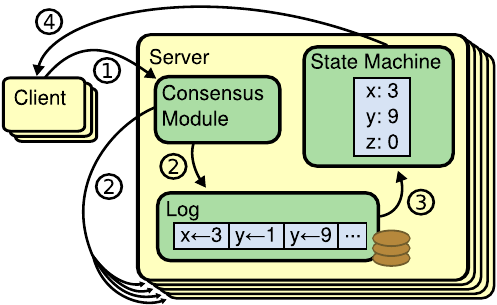

    
# 分布式系统

## 数据一致性（刚性事务）

想要达成数据的一致性（Consistency），需要三个方面：（事务的 ACID 特性）

- 原子性（Atomic），数据操作要么全部完成，要么全部不完成，不存在中间状态
- 隔离性（Isolation），不同的处理流程的数据操作互相独立，互不影响
- 持久性（Durability），处理之后的数据不会丢失、改变。除非由后续操作所改变

在单点部署的系统中，数据一致性由程序逻辑和运行环境来保证。

在分布式系统中，受制于网络、地理环境等不可控因素，数据一致性的实现变得十分困难，需要根据不同的业务对一致性的需求进行综合设计。

## CAP 定理

CAP 是一致性（Consistency）、可用性（Availability）和分区容错性（Partition tolerance）的简写。

CAP 定理的核心思想：一个分布式系统在一致性、可用性和分区容错性上只可能同时满足其中两项。

分区容错性（Partition tolerance）

大多数分布式系统都是分布在多个子网络，每个子网络就叫做一个区。只要有网络交互就一定会有延迟和数据丢失，也就是说分区故障是必然发生的，此时要保证系统不能挂掉，分区容错性是必不可少的。

一致性（Consistency）

写操作之后的读操作，必须返回写后的值。这要求不同机器之间要实现实时同步。

可用性（Availability）

客户端向某个没有宕机的服务端发起请求，服务端必须响应客户端的请求，不能忽略。这要求用户可能向任一台机器发起请求都需要响应。

## 分布式事务（柔性事务）

### BASE 理论（AP 系统）

BASE 是 Basically Available（基本可用）、Soft State（软状态，中间状态）和Eventually Consistent（最终一致性）的缩写。

BASE 的核心思想：在不需要强一致性的场景中，优先保证系统的高可用性，同时采用适当的方式使数据**最终达到一致**。

_分布式的目的是保证系统拥有比单点更高的可用性，由于分布式的特性，分区容错是客观需求，因此现代的架构会采取放弃数据的一致性来保证前两者。_

### 可靠事件队列

实现最终一致性的技术手段可称为基于可靠事件队列的事件驱动模式，可靠事件队列的关键在于可靠的事件投递（重发）和避免事件的重复消费（幂等）。

依靠持续重试来保证可靠性的解决方案被称为“最大努力交付”（Best Effort Delivery）。

可靠事件队列更普遍的形式，称为“最大努力一次提交”（Best Effort 1PC），是将最有可能出错的业务以本地事务的方式完成，采用不断重试的方法促使同一个分布式事务中的其他关联业务全部完成。

_可靠事件队列能保证结果的最终一致，过程简单，但是整个过程并没有考虑数据隔离_

### TCC（Try-Confirm-Cancel）

TCC 适用于需要强隔离性的分布式事务。分为三个阶段：

- Try （预处理）阶段：尝试执行，完成所有业务的可执行检查（保障一致性），预留必须业务资源（保障隔离性）
- Confirm （确认）阶段：所有 Try 分支都成功，进入该阶段并真正执行业务，直接使用 Try 阶段预留的业务资源来完成处理
- Cancel （撤销）阶段：至少有一个 Try 分支失败，进入该阶段，释放 Try 阶段预留的业务资源

- Try 操作，Try X 下单系统创建待支付订单，Try Y 账户系统冻结订单所需的金额
- Confirm 操作，上面操作无错误，Confirm X 订单更新为支付成功，Confirm Y 账户系统扣减订单所需的金额
- Cancel 操作，如果 Try 操作有错误，Cancel X 订单异常，资金退回，Cancel Y 扣款一场，订单支付失败

### SAGA 模型

事务被拆分为多个阶段，每个阶段都有一个或多个服务参与。每个阶段都是一个小事务，执行成功后将执行结果记录在事务日志中。如所有阶段执行成功，则整个 SAGA 事务提交。如其中某个阶段失败，则会执行之间已执行阶段的补偿操作，进行回滚。

优点：
- 服务解耦，将大事务拆分成小事务，降低不同服务的耦合
- 高可靠，每个阶段的结果独立提交，降低对资源锁定的要求
- 提升容错，每个阶段都有补偿机制，可回滚之前执行结果

缺点：
- 数据一致性，采用非严格的一致性模型，特定场景下可能出现数据不一致
- 复杂度高，每个子事务需要有单独的补偿机制，增加开发和维护难度
- 性能消耗，补偿操作可能会影响系统性能

### 幂等性

计算机中幂等性是指一个操作多次执行的结果与执行一次的结果相同。用数学语言表示为f(x) = f(f(x)) = f(f(f(x))) = f(...f(f(x)))

常用实现方案：

- 全局唯一 ID，例如 snowflake 算法
- Token 机制，当验证 token 是第一次执行并有效时，放行并删除 token；后续的相同执行操作则会被阻止。高并发情景下需要保证 token 操作的原子性

ABA 问题，指后面发起的操作结果被前面操作重试所产生的结果所影响，解决方式一般是增加序号以确认两个操作的先后，如增加操作的版本号

## 共识机制

共识（Consensus）是某件事情（如选举、分布锁、全局ID、数据复制等）达成一致的过程及算法。

在分布式系统中，为了消除单点故障，通常会使用副本容错，因此衍生出一个问题，如何保证副本之间的一致性？

> 这里的一致性指线性一致性，指让分布式系统表面看起来类似一个单点系统（不是实时一致），读写操作是原子性的，如此应用程序可以忽略底层之间的副本同步问题。

**复制状态机**是实现容错的的基本方法：多台机器具有完全相同过的状态，运行完全相同的确定性状态机。多台机器协同工作，从而实现少数机器故障不影响整体可用。

复制状态机工作流程：

1. 客户端请求
2. 上层业务应用向底层的复制日志（共识）模块写入日志
2. 复制日志（共识）模块基于共识协议进行**日志复制**，将日志复制到所有节点
3. 底层复制日志模块通知上层应用执行日志中的操作
4. 服务端返回响应结果

业务逻辑与日志复制（共识过程）独立演进，互不影响，日志复制模块可以做成通用模块复用。

在云原生的架构中，为了更加解耦业务逻辑和日志复制（共识），将日志抽象成多个上层业务共享的日志模块。这种存储计算分离的架构是的共享日志模块变成了一个存储系统，向上层应用提供日志读写模块，应用通过共享日志实现状态同步。

### 拜占庭将军问题

拜占庭将军问题讨论的是允许存在少数节点作恶（消息可能被伪造）场景下如何达成共识的问题。

- 口信消息型
  - 任何已发送的消息都将被正确传达
  - 接收者知道消息的发送者
  - 消息的缺席可以被检测

- 签名消息型
  - 忠诚将军的签名无法被伪造，对已签名消息的更改可以被发现
  - 任何人都可验证消息签名的真伪

拜占庭容错算法解决的是最困难、最复杂的分布式场景，该场景除了存在故障行为，还存在恶意行为。如区块链

非拜占庭容错算法解决的是只存在故障行为，不存在恶意行为的场景。如计算机分布式系统

- Paxos 算法
- Raft 算法

      