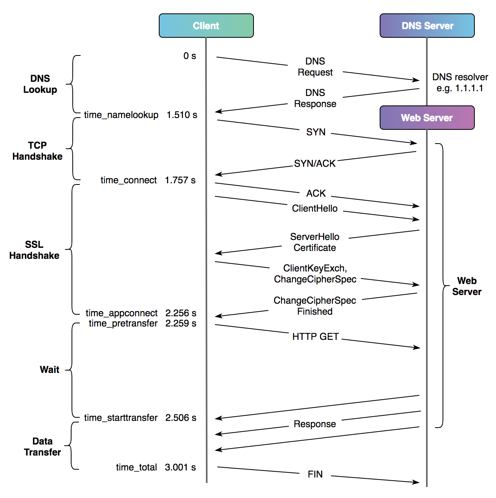

    
<small style="color: #ccc;">last modified at 2023/12/7 8:54:31</small>
# Internet Network

## HTTPS 请求阶段分析

一个完整、无任何缓存、未复用链接的 HTTPS 请求：



1. DNS 解析
2. TCP 握手
3. SSL 握手
4. 等待服务端处理
5. 数据传输

## HTTPS 请求耗时分析

一个 HTTPS 请求共需要 5 RTT = 1 RTT(DNS lookup) + 1 RTT(TCP Handshake) + 2 RTT(SSL Handshake) + 1 RTT(Single Response) 

假设 1 RTT 的 延迟是 x，一个 HTTPS 请求至少会有 5 RTT * x 的网络延迟，这是物理设施的限制，很难降到 5x 以下。

### 使用 curl 进行延迟分析

```shell
root@DESKTOP-68MHSLG:~# curl -w '\n time_namelookup=%{time_namelookup}\n time_connect=%{time_connect}\n time_appconnect=%{time_appconnect}\n time_redirect=%{time_redirect}\n time_pretransfer=%{time_pretransfer}\n time_starttransfer=%{time_starttransfer}\n time_total=%{time_total}\n' -o /dev/null -s 'https://www.bing.com/'

# output
 time_namelookup=0.012965 # 从请求开始到域名解析完成的耗时
 time_connect=0.014851 # 从请求开始到 TCP 三次握手完成的耗时
 time_appconnect=0.194589 # 从请求开始到 TLS 握手完成的耗时
 time_redirect=0.000000 # 重定向时间，包括内容传输前的重定向 DNS 解析、TCP 握手、内容传输等耗时
 time_pretransfer=0.194628 # 从请求开始到向服务端第一个 GET/POST 请求开始前的耗时
 time_starttransfer=0.294620 # 从请求开始到内容传输前的耗时
 time_total=0.294650 # 请求的总耗时
```

## 域名解析

<div align="center">
  
  <p>解析流程（无缓存）</p>
</div>


- Client 向 `DNS 解析器`（也叫递归解析器，如 8.8.8.8）发出解析 example.com 域名的请求
- DNS 解析器判断是否有缓存，如有则返回缓存结果；如无则向最近的 `Root nameserver`（根域服务器）请求所属的 `TLD 顶级域名服务器`
- 获取 .com 的 TLD 域名服务器后，向该服务器请求域名的 `Authoritative nameserver`（权威解析服务器）
- 得到权威解析服务器地址后，向该服务器获取域名对应的 `IP 地址`，解析完成

故障排查

1. 使用 [nslookup](https://learn.microsoft.com/en-us/windows-server/administration/windows-commands/nslookup) 命令

```shell
root@DESKTOP-68MHSLG:~# nslookup www.bing.com
Server:         172.31.64.1  # DNS 解析器
Address:        172.31.64.1#53

Non-authoritative answer: # 因为 DNS 解析器只是转发权威解析服务器的记录，所以为非权威应答
www.bing.com    canonical name = www-www.bing.com.trafficmanager.net. # cname 记录
www-www.bing.com.trafficmanager.net     canonical name = cn-bing-com.cn.a-0001.a-msedge.net.
cn-bing-com.cn.a-0001.a-msedge.net      canonical name = china.bing123.com.
Name:   china.bing123.com 
Address: 202.89.233.101
Name:   china.bing123.com
Address: 202.89.233.100
Name:   ns1-04.azure-dns.com
Address: 13.107.236.4
Name:   ns2-04.azure-dns.net
Address: 150.171.21.4
Name:   ns3-04.azure-dns.org
Address: 204.14.183.4
Name:   ns4-04.azure-dns.info
Address: 208.84.5.4
Name:   ns1-04.azure-dns.com
Address: 2603:1061:0:700::4
Name:   ns2-04.azure-dns.net
Address: 2620:1ec:8ec:700::4
Name:   ns3-04.azure-dns.org
Address: 2a01:111:4000:700::4
Name:   ns4-04.azure-dns.info
Address: 2620:1ec:bda:700::4
```

2. 使用 [dig](https://en.wikipedia.org/wiki/Dig_(command)) 命令

```shell
root@DESKTOP-68MHSLG:~# dig www.bing.com

; <<>> DiG 9.18.12-0ubuntu0.22.04.2-Ubuntu <<>> www.bing.com
;; global options: +cmd
;; Got answer:
;; ->>HEADER<<- opcode: QUERY, status: NOERROR, id: 58416 # opcode: QUERY 表示查询， status: NOERROR 表示解析成功
;; flags: qr rd ad; QUERY: 1, ANSWER: 13, AUTHORITY: 0, ADDITIONAL: 0
;; WARNING: recursion requested but not available

;; QUESTION SECTION: # DNS 请求参数
;www.bing.com.                  IN      A # A 表示默认查询 A 记录

;; ANSWER SECTION: # 部分结果
www.bing.com.           0       IN      CNAME   www-www.bing.com.trafficmanager.net.
www-www.bing.com.trafficmanager.net. 0 IN CNAME cn-bing-com.cn.a-0001.a-msedge.net.
cn-bing-com.cn.a-0001.a-msedge.net. 0 IN CNAME  china.bing123.com.
china.bing123.com.      0       IN      A       202.89.233.100
china.bing123.com.      0       IN      A       202.89.233.101
ns1-04.azure-dns.com.   0       IN      A       13.107.236.4
ns2-04.azure-dns.net.   0       IN      A       150.171.21.4
ns3-04.azure-dns.org.   0       IN      A       204.14.183.4
ns4-04.azure-dns.info.  0       IN      A       208.84.5.4
ns1-04.azure-dns.com.   0       IN      AAAA    2603:1061:0:700::4
ns2-04.azure-dns.net.   0       IN      AAAA    2620:1ec:8ec:700::4
ns3-04.azure-dns.org.   0       IN      AAAA    2a01:111:4000:700::4
ns4-04.azure-dns.info.  0       IN      AAAA    2620:1ec:bda:700::4

;; Query time: 10 msec
;; SERVER: 172.31.64.1#53(172.31.64.1) (UDP)
;; WHEN: Wed Nov 08 23:06:15 CST 2023
;; MSG SIZE  rcvd: 626
```

**上述 www.bing.com 查询结果，分布在不同的权威域中，避免单个权威域故障导致整个服务不可用的问题。**

### HTTPDNS

HTTPDNS 使用 HTTP 协议直接向权威解析服务器发起请求，从而获取域名的 IP 地址，跳过默认 DNS 解析的过程。

使用 HTTP(S) 协议绕过 ISP 的 Local DNS，避免域名劫持，配合客户端策略（预解析、懒加载），可以实现低延迟的域名解析。

## HTTP 服务优化

### 数据包压缩

HTTP 客户端与服务端的主动协商机制：


- [gzip](https://www.gnu.org/software/gzip/manual/gzip.html) 压缩算法
- [brotli](https://github.com/google/brotli) 压缩算法

- [protobuf] 编码，序列化的 string 类型 和 byte 类型是直接存储的，int 类型采用变长压缩。在传输过程中依然需要压缩
  - 序列化方式，比 JSON、XML 更紧凑
  - 需要 .proto 数据结构描述文件才能解析成正常数据

### SSL 层

#### 解决信息传递的安全性

一对一通讯，使用对称加密即可，只要保证密钥的安全性。一对多通讯怎么办？

一对多通讯，对称加密的算法和密钥，每个客户端需要是不同的。这需要服务端和客户端有协商的过程。但是协商过程本身是明文的，如何保证协商过程的安全？

因此我们引入非对称加密。服务端使用私钥加密，客户端使用公钥解密。如何安全地向客户端发送公钥？

这时我们需要一个可靠的第三方机构，使用第三方机构的私钥对服务端公钥加密然后传输给客户端，客户端在使用第三方的公钥进行解密。如何把第三方公钥放在客户端？

解决方案是提前预装在操作系统内，这是操作系统内根证书的由来。

> 可靠的第三方机构就是 HTTPS 中的 CA（Certificate Authority，证书认证机构）

HTTPS 中把公钥规范成数字证书的形式由 CA 签发，数字证书通常包含（服务端公钥，持有者信息，CA 信息及过期信息）。由服务端向 CA 申请证书，然后下放到客户端。客户端根据系统预装的根证书对下载的证书进行合法性校验。

#### 如何优化

1. 协议升级，从 TLS 1.2 升级到 TLS 1.3，减少握手时间（减少往返的次数）

2. 验证证书过程，启用 OCSP Stapling，让证书状态随着证书一起下方到客户端，因此客户端无需再向第三方发送证书验证请求
 
> - CRL（Certificate Revocation List）证书撤销列表，是由 CA 机构维护的一个列表，列表中包含已经被吊销的证书序列号和吊销时间。
> - OCSP（Online Certificate Status Protocol）在线证书状态协议，是一种改进的证书状态确认方法，用于减轻证书吊销检查的负载和提高数据传输的私密性，相比于 CRL ，OCSP提供了实时验证证书状态的能力。
> - OCSP Stapling 是 OCSP 的改进方案，将原本需要客户端实时发起的 OCSP 请求转嫁给服务端，服务端通过预先访问 CA 获取 OCSP 响应，然后在握手时随着证书一起发给客户端，免去了客户端连接 CA 服务器查询的环节，解决了 OCSP 的隐私和性能问题。

在Nginx 中配置 OCSP Stapling 服务：

```conf
server {
    listen 443 ssl;
    server_name  example.com;
    index index.html;

    ssl_certificate         server.pem; #证书的.cer文件路径
    ssl_certificate_key     server-key.pem; #证书的.key文件

    # 开启 OCSP Stapling 当客户端访问时 NginX 将去指定的证书中查找 OCSP 服务的地址，获得响应内容后通过证书链下发给客户端。
    ssl_stapling on;
    ssl_stapling_verify on; # 启用OCSP响应验证，OCSP信息响应适用的证书
    ssl_trusted_certificate /path/to/xxx.pem; # 若 ssl_certificate 指令指定了完整的证书链，则 ssl_trusted_certificate 可省略。
    resolver 8.8.8.8 valid=60s; # 添加resolver解析OSCP响应服务器的主机名，valid表示缓存。
    resolver_timeout 2s; # resolver_timeout表示网络超时时间
}
```

验证服务端是否开启

```shell
root@DESKTOP-68MHSLG:~# openssl s_client -connect bing.com:443 -servername bing.com -status -tlsextdebug < /dev/null 2>&1 | grep "OCSP"

# 返回成功
OCSP response:
OCSP Response Data:
    OCSP Response Status: successful (0x0)
    Response Type: Basic OCSP Response
        Subject: CN=AzureCA01 OCSP Cert
                OCSP Signing
            OCSP No Check:
```

3. 证书算法

密钥交换和签名的主要方式：

- RSA 密钥交换（无需签名）
- ECDHE 密钥交换，RSA 签名
- ECDHE 密钥交换，ECDSA 签名

内置 RSA 公钥的证书称为 RSA 证书
  - 优势：兼容性广
内置 ECDSA 公钥的证书称为 ECC 证书，
  - 优势：安全性高，处理速度快，证书体积小
  - 劣势：兼容性较 RSA 差，尤其对于 XP 和 Android 2.3 系统

4. 其他手段

硬件加速：(提升加解密处理速度)

- 使用支持 AES-NI 特性的 CPU
- 专用 QAT 加速卡

> 英特尔® Quick Assist Technology（简称 QAT）是 Intel 公司推出的一种专用硬件加速技术，可以用来提高 Web 服务器中计算密集的公钥加密以及数据压缩解压的吞吐率以及降低 CPU 负载。

### 传输层

#### 网络拥塞控制

BBR 拥塞控制算法

BBR 将控制时机提前，不再等待丢包时再进行暴力控制，而是控制稳定的发包速度，尽量榨干带宽，却又不让报文在中间设备的缓存队列上堆积。
  - 为了榨干带宽，BBR 会周期性地探测链路状况，来调整发包速率
  - 为了队列不堆积，BBR 周期性地探测链路的最小 RTT，来计算发包速率
  - 上诉探测是交替进行的，并不是同时的

BBR 状态机

BBR 有 4 种状态：
- 启动，慢启动 - 指数增加发送速率（探测带宽最大值） - 发送速率不再增长 - 切换到排空
- 排空，指数降低发送速率（启动逆过程），排空多占的 buffer
- 带宽探测，测量到带宽最大值和延迟最小值后，稳定维护该网络状态，偶尔小幅提速测量带宽或降速让出带宽。大部分运行在此阶段
- 时延探测，未测量到更小或相等的 RTT 时进入此阶段，对 RTT 进行重新测量

BBR 在大带宽长链路（如跨海通讯），尤其是有轻微丢包的网络环境中，比传统的 cubic 算法有很大的提升。

### 网络层

#### 动态加速服务

全球性或区域性的动态加速网络（Dynamic Site Accelerator）服务，使用边缘设备提升网络访问体验

大致流程：

- 源站提供一个测试资源
- 服务商在源站周边选择一批边缘节点
- 边缘节点对测试资源进行下载测试，根据丢包率、RTT、hops（跳数）等选择最佳路由

> hops（跳数），即是一台路由器/主机到另外一台路由器/主机所经过的其它路由器的数量，中间的距离越远，即经过路由转发的次数越多，hops 就越大

### 新版 HTTP 协议 或者 QUIC

#### QUIC

QUIC（Quick UDP Internet Connection，快速 UDP 网络连接）是基于 UDP 封装的安全可靠的传输协议，旨在提供比 TCP 更高效的网络传输。

<div  align="center">
	
	<p>HTTP 协议不同版本对比</p>
</div>

TCP 的一些缺点：

- 握手延迟大，HTTPS 至少需要 3个 RTT。
- TCP 的流数据必须按顺序处理，如果某个流数据丢失，后续流数据会被阻塞，知道丢失的流数据重传。
- TCP 协议自身的更新升级因某些原因比较困难。

QUIC 的特点

- 支持连接迁移，用户环境发生变化时（如 WiFi 切换到 4G），TCP 基于四元组（源端口、源IP、目标端口、目标IP）无法保持连接的存货，QUIC 是使用连接 ID 识别的，但环境发生改变时，更容易保活，实现无缝切换
- 低延时，这是基于 UDP 的好处，无需 TCP 的握手
- 可插拔拥塞控制，因为是基于 UDP 的，运行在用户态，拥塞控制算法切换无需更改内核
- 降低对丢包的敏感度，单个连接上每个流之前没有顺序依赖，QPACK 表头压缩格式减少冗余数据传输，在弱网络上传输效率更高

部署 QUIC 需要考虑的问题

客户端：
- 应用适配成本和收益的权衡
- 同时兼容新旧网络协议，方便降级

服务端：
- 网络事件模型适配 QUIC 和 TCP
- 后端架构适配 QUIC，如 负载均衡、QUIC 流量转换成一般 HTTP/1 流量，发送到后端应用
- 多区域，多节点 QUIC 连接复用和迁移
- 能耗比如何与 TCP 一样

      