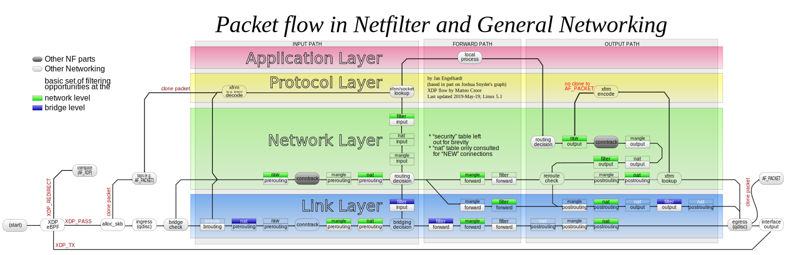

    
<small style={{color: '#cccccc'}}>last modified at December 7, 2023 16:56</small>
#  Linux Network

## 网络请求处理

<div align="center">
  
  <p>Linux ingress 架构</p>
</div>

1. 网卡 eth0 收到**数据包**
2. 网卡通过 DMA 将数据包**拷贝**到内存的环形**缓冲区**（Ring Buffer）
3. 数据从网卡拷贝到内存后，网卡产生硬件中断（Interrupt ReQuest）**告知内核有新数据到达**
4. 内核收到中断后，调用中断处理函数，唤醒 ksoftirqd 内核线程处理软中断
5. 内核进行软中断处理，调用 NAPI poll 接口将内存中的数据包**送往更上层处理**
6. 内核中网络协议栈：L2 处理
7. 内核中网络协议栈：L3 处理
8. 内核中网络协议栈：L4 处理
9. **网络协议栈处理后**，将数据**发送至对应应用**的 socket 接收缓冲区

> 在高并发（如 1000 万级别）的系统中，用户态和内核态的频繁切换，网络协议栈的处理流程，也就是**内核**是高并发产生瓶颈的关键原因

## Netfilter 框架

Netfilter 是从 Linux Kernel 2.4 起，内核开放的一套通用的、可提供代码干预数据在协议栈流转的过滤框架。

<div align="center">
  
  <p>协议栈处理流程和 Netfilter 框架</p>
</div>

_注：上面图中，带颜色部分为 Netfilter 模块_

Netfilter 在包手法和路由的管道中，切了 5 个口（hook），包括：

- PREROUTING
- FORWARD
- POSTROUTING
- INPUT
- OUTPUT

其他**内核模块**（如 iptables）可以向这些 hook 点注册处理函数，进而实现对数据包的过滤、修改、SNAT/DNAT 等各类功能

> SNAT(Source Network Address Translation)：源网络地址转换，内部地址要访问公网上的服务时，内部地址会主动发起连接，将内部地址转换为公网IP。

> DNAT(Destination Network Address Translation)：目标地址转换，内部需要对外提供服务时，外部主动发起连接，路由器或者防火墙的网络接收到这个连接，然后将连接转换到内部，此过程是由带公网ip的网关代替内部服务来接收外部的连接，然后在内部做地址转换。

### iptables 和 Netfilter

Netfilter 的钩子回调固然强大，但仍要通过程序编码才能使用，并不适合系统管理员日常运维，而设计 iptables 的目的便是以配置的方式实现原本用 Netfilter 编码才能做到的事情。iptables 在用户空间管理数据包处理规则，内核中 Netfilter 根据 iptables 的配置对数据包进行处理。

iptables 包括 “tables（表）”、“chain（链）”和“rule（规则）”三个层面。

iptables 使用表来组织规则，如果规则是处理网络地址转换的，会放到 nat 表；如果是判断是否允许包继续向前的，会放到 filter 表。每个表内部的规则会被进一步组织成链（**链的规则是可以跨表的**），链有内置（Netfilter）的 hook 触发后数据包按顺序匹配里面的规则。

内置链：

- PREROUTING：**接收**的数据包**进入协议栈后**立即触发，在进行**任何路由判断（包发往哪里）之前**
- INPUT：数据包经过路由判断后，如果**目的是本机**，会触发此链
- FORWARD：数据包经过路由判断后，如果**目的是其他机器**，会触发此链
- OUTPUT：**本机产生**的准备发送的包，**进入协议栈后**立即触发
- POSTROUTING：**本机产生或转发**的包，经**由路由判断**后，会触发此链

<div align="center">
  
  <p>iptables 中的 chain 和 table</p>
</div>

iptables 的规则允许数据包跳转到其他链继续处理，同时 iptables 也支持创建自定义链。但是自定义链没有注册到 Netfilter hook，所以自定义链只能通过从内置链的规则跳转过来。

<div align="center">
  
  <p>iptables 的自定义链</p>
</div>

### iptables 的性能问题

iptables 的规则匹配是线性（按顺序的逐条）的，匹配的时间复杂度 O(N)，规则更新是非增量式的，增删改一条规则也是整体修改 iptables 规则，当集群规模较大时会有性能问题。

因此对于大规模集群可使用专门用于负载均衡的 IPVS，实现上使用了更高效的哈希表，匹配时间复杂度 O(1)，规模和性能无关。

### conntrack 连接追踪

连接追踪是发现并跟踪连接的状态：

- 从数据包中提取元组信息，辨别数据流和对应的连接
- 维护所有连接的状态数据库，如创建时、发送包数、发送字节数等
- 回收过期连接
- 为上层提供服务（如 NAT）

当加载内核模块 nf_conntrack 后，conntrack 机制开始工作，在内核中有两处位置（PREROUTING 和 OUTPUT 之前）能够追踪数据包。

每个通过 conntrack 的数据包，内核会为其生成一个 conntrack 条目用以跟踪此连接。如果是已有连接，则更新对应条目的状态，否则就新建一个 conntrack 条目。

所有的 conntrack 条目都存放在连接跟踪表，该表存放于系统内存中，用命令 `cat /proc/net/nf_conntrack` 可以查看所有条目。

连接跟踪是许多网络应用的基础，如 NAT，当 NAT 网关收到内部网络的请求包之后，会做 SNAT，同时将本次连接记录保存到连接跟踪表中；当收到响应包之后，根据连接跟踪表确定目的主机并做 DNAT。（SNAT + DNAT= Full NAT）

### 快速数据路径 XDP

由于 Linux 内核协议栈更加注重通用性，所以在网络性能要求高的场景存在一定的瓶颈。伴随着 eBPF 技术的成熟，Linux 迎来了高性能网络应用开发解决方案 XDP（eXpress Data Path）。XDP 本质上是内核网络模块的一个 BPF hook，能够动态挂载 eBPF 程序，使内核能够在数据报文到达 L2（网卡驱动层）时就对其进行针对性处理，无需再进入内核协议栈。

XDP 程序在内核提供的网卡驱动中直接取得网卡收到的数据帧，然后直接送到用户态应用程序。应用程序利用 AF_XDP 类型的 socket 接收数据。

<div align="center">
  
  <p>XDP 概念</p>
</div>

_应用实例： 云原生网络方案 Cilium_

> [eBPF](https://ebpf.io/) 全称 extended Berkeley Packet Filter。一般来说，要向内核添加新功能，需要修改内核源代码或者编写 内核模块来实现。而 eBPF 允许程序在不修改内核源代码，或添加额外的内核模块情况下运行。

## 系统内核网络优化

### 网卡多队列

在多核 CPU 的服务器上，网卡会有多个 Ring Buffer，网卡负责将接收到的数据包分配给不同的 buffer 区域，同时触发的中断可以分配给多个 CPU 内核，提高并行处理能力。

_网卡需要支持 RSS（Receive Side Scaling）或者 multiqueue 功能_

1. 判断网卡收包情况

```shell
$ ifconfig eth0 | grep -E 'RX|TX'

RX packets 490423734  bytes 193802774970 (180.4 GiB)
RX errors 12732344  dropped 9008921  overruns 3723423  frame 0
TX packets 515280693  bytes 140609362555 (130.9 GiB)
TX errors 0  dropped 0 overruns 0  carrier 0  collisions 0
```

以上查询结果中， `RX dropped` 表示数据包已经进入 Ring Buffer，但是由于系统原因（如内存不足）导致在拷贝到内存的过程中被丢弃，`RX overruns` 错误是 Ring Buffer 传输的 IO 大于内核能够处理的 IO 阈值，CPU 无法及时处理中断造成 buffer 溢出。

2. RSS 下多队列调整

RSS 利用网卡多队列的特性，将每个 CPU 内核分别与网卡的一个收发队列绑定，从而使网卡的硬中断和软中断均衡地分配。

查询 RX/TX 队列配置

```shell
$ ethtool -l eth0

Channel parameters for eth0:
Pre-set maximums:
RX:		0
TX:		0
Other:		0
Combined:	8 # 硬件最多支持 8 个 RX/TX 队列
Current hardware settings:
RX:		0
TX:		0
Other:		0
Combined:	4 # 当前只使用了 4 个
```

设置队列数量为 8

```shell
ethtool -L eth0 combined 8
```

查看队列大小

```shell
$ ethtool -g eth0

Ring parameters for eth0:
Pre-set maximums:
RX:		1024
RX Mini:	0
RX Jumbo:	0
TX:		1024 # 硬件支持多个 1024 个 RX/TX 数据包
Current hardware settings:
RX:		512
RX Mini:	0
RX Jumbo:	0
TX:		512 # 当前只用到 512 个数据包
```

修改队列大小，增大队列大小可以在 PPS （packets per second，包每秒）很大时缓解丢包问题

```shell
ethtool -G eth0 rx 1024
```

_开启网卡的多核并发特性后，会挤压其他代码的 CPU 执行时间，需要根据业务场景和实际需求考虑。_

### 内核协议栈

1. TCP 握手流程

处于 “LISTENING” 状态的 TCP socket，有两个独立的队列：
- SYN 队列，存储收到 SYN 包的连接（net.ipv4.tcp_max_syn_backlog）
- Accept 队列，已建立好的连接，即等待被上层应用取走的连接（min(backlog，net.core.somaxconn)）

SYN 队列收到 client 的 SYN 包后，回复 SYN + ACK 包并等待从 client 返回的 ACK 包（即三次握手的最后一个包）。当收到 ACK 包时，找到对应的 SYN 队列并检查数据是否匹配，如果匹配，内核将该连接相关数据从 SYN 队列中移除并创建一个完整的连接，加入到 Accept 队列

需要增大队列的情况：
- 有高性能网络需求的应用服务
- 对于 client 与 server 之间延迟较大的场景

SYN 队列的每个槽位需要占用内存，需要注意 SYN Flood 攻击。

2. TCP 连接保活

TCP 连接建立后会发送一个空 ACK 来保持连接，受以下参数影响：

- net.ipv4.tcp_keepalive_time 最大闲置时间
- net.ipv4.tcp_keepalive_intvl 发送探测包的时间间隔
- net.ipv4.tcp_keepalive_probes 最大失败次数，超过此值后将通知应用层连接失效

可以通过调整上述参数，防止空 ACK 占满 backlog 队列

3. TCP 连接断开

TCP 连接的建立 采用**客户服务器**方式，**主动**发起连接建立的应用进程叫做 TCP **客户** (client)，**被动**等待连接建立的应用进程叫做 TCP **服务器** (server)，任何一方都可以在数据传送结束后发出连接释放的通知。


<div align="center">
  
  <p>TCP 挥手</p>
</div>

1. client 向 server 发送 TCP 报文表明想要释放 TCP 连接，进入 FIN-WAIT 阶段
2. server 收到 client 请求断开连接的 FIN 报文后，结束 ESTABLISHED 阶段，进入 CLOSE-WAIT 阶段并返回一段 TCP 报文
3. client 收到 server 的报文，确认 server 已收到释放连接的请求，client 从 FIN-WAIT-1 进入到 FIN-WAIT-2 阶段
4. server 发出报文后，将未传输的数据传送给 client，完成后进入 CLOSE-WAIT 阶段，再次向 client 发送 TCP 报文并进入 LAST-ACK 阶段
5. client 再次收到 server 的报文后，确认 server 已准备好释放连接，结束 FIN-WAIT-2，进入 TIME-WAIT 阶段，最后向 server 发送一次报文
6. server 收到 client 的最后一个报文后，结束 LAST-ACK 阶段，进入 CLOSED 阶段并关闭连接
7. client 在发送报文后等待 2MSL（确保 server 可以收到最后一个报文），结束 TIME-WAIT 阶段，进入 CLOSED 阶段并关闭连接

在反向代理节点中，TIME-WAIT 阶段的连接过多，会占用大量的资源（如本地端口），出现代理不可用的情况。

可调参数：

- net.ipv4.tcp_max_tw_buckets，此数值定义系统在同一时间最多能有多少 TIME_WAIT 状态，当超过这个值时，系统会直接删掉这个 socket 而不会留下 TIME_WAIT 的状态
- net.ipv4.ip_local_port_range，TCP 建立连接时 client 会随机从该参数中定义的端口范围中选择一个作为源端口。可以调整该参数增大可选择的端口范围。

### 内核旁路技术

高并发下内核的网络协议栈的冗长流程时瓶颈所在，那么绕过内核是一种很有效的解决方案。诞生出基于内核旁路思想的高性能网络数据处理框架，DPDK 是其中的代表之一。

DPDK 为 Intel 处理器架构下的用户空间提供高效的数据包处理支持（包括库函数和驱动），它不同于 Linux 系统以通用性设计为目的，是专注于网络应用中数据的高效处理，绕过内核协议栈，在用户空间实现一套数据平面来进行数据包的收发与处理。

传统内核网络，数据从 网卡 ==》驱动 ==》协议栈 ==》socket 接口 ==》业务

DPDK 基于内核旁路的方式， 数据从 网卡 ==》DPDK 轮询模式 ==》DPDK 基础库 ==》 业务

<div align="center">
  
  <p>DPDK 与 传统内核网络</p>
</div>
      