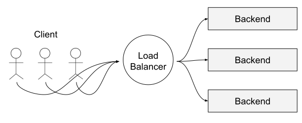
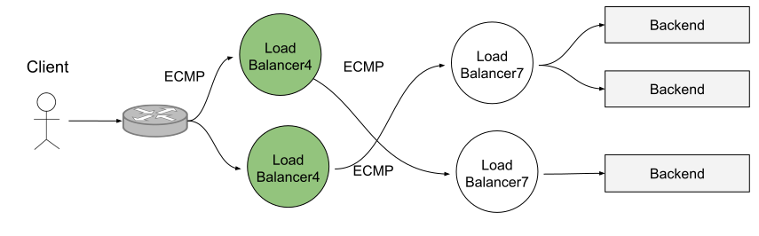
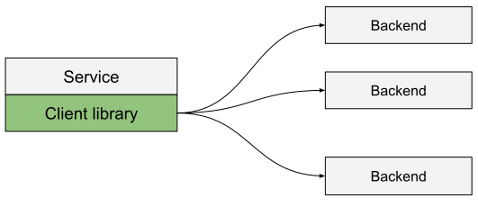
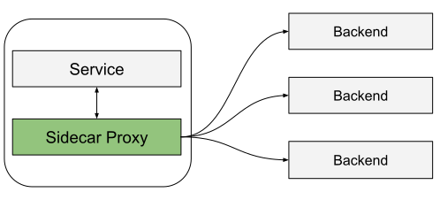
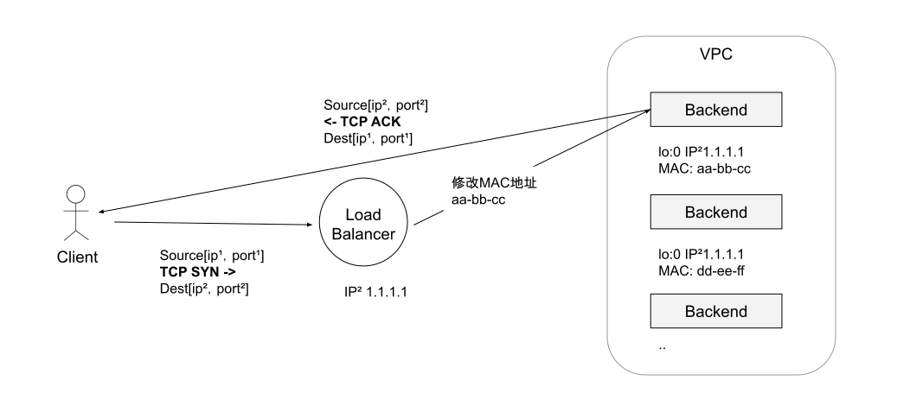
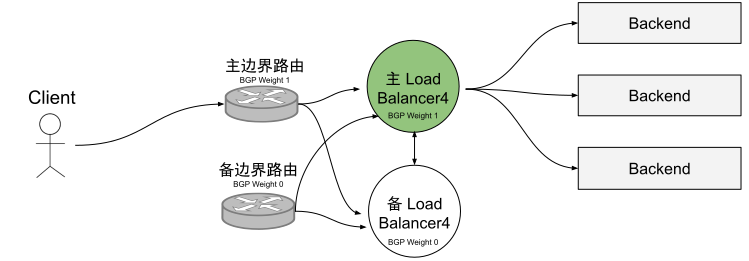
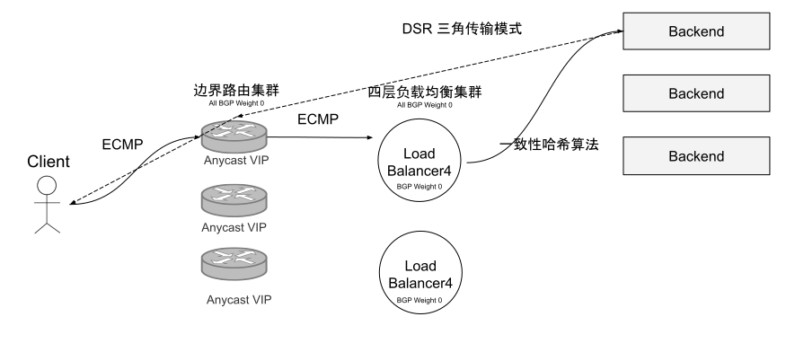
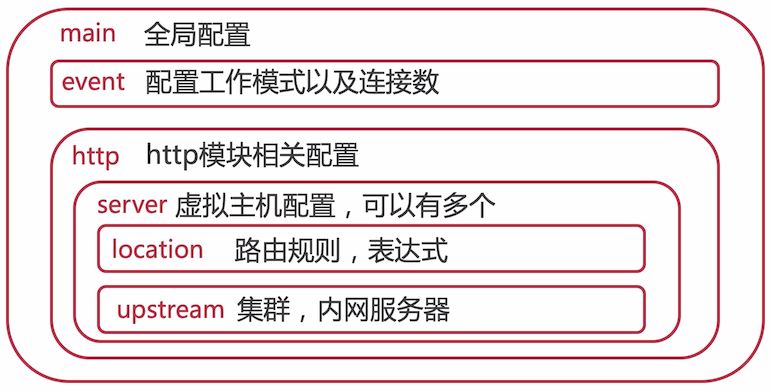

    
<small style="color: #ccc;">last modified at 2023/12/7 8:54:31</small>
# Load Balance

负载均衡是构建可靠的分布式系统的核心概念之一，核心职责是“选择谁来处理请求”和“将请求转发过去”。

## 拓扑类型

### 中间代理



中间代理模式优点是简单，用户只需要通过 DNS 连接到负载均衡服务器，不用关心其他。缺点是负载均衡服务器是单点的，横向扩展有瓶颈。

### 边缘代理



分级部署的方式：

- 第一级是网络边缘部署的四层均衡服务器
- 第二级是能识别应用协议的七层均衡服务器
_现代分布式架构还要求二级均衡服务器提供额外的“API 网关”功能，例如：限速、鉴权以及复杂流量路由_

### 客户端嵌入 / Sidebar



负载均衡服务以函数库/SDK 的方式内嵌到客户端代码中，具有分布式代理的特性，消除单点故障和扩展问题。但是对多语言、大规模系统的部署不方便。



服务网格是客户端内嵌的变种，将流量导到独立的进程，牺牲一些（延迟）性能，拥有客户端模式的优点但没有编程语言绑定的问题。

## 四层负载均衡（转发）

“四层负载均衡“是多种均衡工作模式的统称，这些模式的共同特点是维持同一个 TCP 连接，不只是工作在 OSI 模型的传输层。

主要工作：
- 二层（数据链路层），改写 MAC 地址
- 三层（网络层），改写 IP 地址
- 四层（传输层），改写 UDP/TCP 协议端口，此时流量已经到达目标主机

### 四层负载均衡工作模式

1. 链路层均衡负载

数据链路层负载均衡就是修改请求的数据帧中 MAC 目标地址，让原本发送给负载均衡服务器请求的数据帧，通过二层交换机转发至上游服务器，上游服务器可以接收到这个数据帧。由于只修改 MAC 地址，IP 层（ip地址）没有变化，客户端收到的响应中的服务器 IP 地址必须与之前发送的目标服务器 IP 地址一致才能被继续处理，所以上游服务器的虚拟 IP 需与接收数据帧的目标 IP 地址保持一致。



只有请求经过负载均衡服务器，而响应无需通过负载均衡服务器原路返回；整个请求、转发、响应的链路形成一个“三角关系”，所以被称为“三角传输模式”（Direct Server Return）或者叫“单臂模式”（Single Legged Model）

优势：
- 在一些场景中，响应的流量要远远大于请求的流量（如 HTTP 请求），这样用更少的带宽满足系统需求

劣势：
- 负载均衡服务器无法知晓 TCP 连接的完整状态（只有 SYN，没有 ACK）
- 工作在数据链路层，无法跨子网
- 上游服务器需要能访问外网
- 上游服务器的虚拟 IP 需与接收数据帧的目标 IP 地址保持一致

_该模式适合作为数据中心的第一级路由（工作效率极高），用来连接其他上游负载均衡服务器。_

2. 网络层均衡负载

tunnel（隧道）模式

1. 保持原数据包不变+
2. 将原数据包整体放进新的 IP 数据包的 payload 内
3. 通过三层交换机发送到上游服务器
4. 上游服务器通过对应的拆包机制，将之前添加的 header 去除
5. 解析 payload 中的原数据包并做正常处理

优势：
- 支持跨子网
- 依然具有三角传输的优势

劣势：
- 需要上游服务器支持拆包机制，支持隧道协议
- 上游服务器需要能访问外网
- 上游服务器的虚拟 IP 需与接收数据帧的目标 IP 地址保持一致

NAT 模式

1. 将原数据包 header 的目标 IP 地址改写为上游服务器的 IP 地址，源 IP 改写为负载均衡服务器自己的 IP
2. 经过三层交换机转发到上游服务器
3. 上游服务器将响应发送给负载均衡服务器
4. 负载均衡服务器将源 IP 改写为自己，目标 IP 改写为客户端 IP

优势：
- 支持跨子网
- 上游服务器不需要连接外网

劣势：
- 收发都经过负载均衡服务器，单点压力很大

### 四层负载均衡高可用

主备设计



一组主备边缘路由器提供若干 VIP，通过 BGP 协议通告 VIP，主边缘路由权重高于备份，类似的，主四层负载均衡服务器向边缘路由器的权重比备用四层负载均衡服务器。主四层负载均衡服务器正常情况处理所有流量，主备四层负载均衡服务器交叉连接，共享所有的连接跟踪状态。

主备方案的问题是正常情况下 50% 的容量是空闲的，备用机一直空转，资源利用率不足。当主备实例同时挂掉时，服务会宕机。

基于集群的一致性哈希容错和可扩展设计



- 多个边缘路由器以相同的 BGP 权重通告所有 Anycast VIP，通过 ECMP（Equal-cost, Multi-path routing）保证每个 flow 的所有包都会到达同一个边缘路由器
- 多个四层负载均衡服务器以相同的 BGP 权重向所有的边缘路由器通告所有的 VIP 继续使用 ECMP 的方式为相同 flow 的包选择相同的四层负载均衡服务器
- 每个四层均衡负载服务器实例会做部分连接跟踪的工作，然后使用一致性哈希为每个 flow 选择一个后端服务器。通过 GRE 封装将包发送到该后端服务器
- 后端服务器使用 DSR 将响应数据包发送到边缘路由器，最后到客户端

上述结构的核心是使用 ECMP，边缘路由和负载服务器可按需添加。当添加新实例后，最大程度地减少受影响的 flow。

## 七层负载均衡（代理）

_为什么需要七层负载均衡？_

负载均衡算法，力求同一 session 的连接指向同一个后端服务器。但 L4LB 不感知其转发流量的应用细节，例如：HTTP 协议、Redis 协议 或 其他应用层协议。因此同一个客户端的流量会尽量由相同的后端服务器处理，当某个客户端流量超过其他客户端流量很多时，处理该客户端的后端服务器的负载会远高于其他后端服务器，这种现象是不符合负载均衡的思想的。

七层负载均衡由于需要识别应用层协议，需要将 TCP 连接交由用户态的程序处理，再通过**代理**的方式向后端服务器发送请求。

L7 之前需要 L4 的必要性：

- L7 更多承担的是应用流量分析、转换和路由的工作。L7 处理原始流量的能力较 L4 差，这是工作原理决定的，因此 L4 更适合用来应对 SYN 攻击等流量攻击。
- L7 的部署更为频繁且功能更多。在做 L7 部署调试时，可以通过 L4 来做健康检查和流量排除。

### Nginx 代理



同一个指令放在不同层级的块中，作用域不同。一般情况，高一级块中的指令可以作用域自身和所包含的低级块。如果某个指令同时在不同层级的块中出现，采用“就近原则”，即低级块的配置为准。

1. 缓冲（buffer）

作为反向代理，缓冲解决后端服务网络与用户网络不对等的情况，如：Nginx 到 Server 是 10M/s，客户端到 Nginx 是 100K/s。不开启缓冲，Nginx 需要长时间处理客户端与后端服务之间连接，易出现连接积压。

```conf
location / {
    proxy_buffers 16 4k; # 缓冲区大小
    proxy_buffer_size 2k; # 后端响应的第一部分缓冲区
    proxy_pass http://localhost:8080;
}
```

2. 缓存（cache）

Nginx 将缓存保持在磁盘中，返回给客户端的数据优先从缓存中读取，减少发送到后端的请求。缓存区可被多个 Server 共享。

```conf
http {
	proxy_cache_path /var/cache/nginx/data keys_zone=mycache:10m; # 缓存的位置、名称、大小
	server {
 		location = /html/demo.html {
	        proxy_cache mycache; 
	        proxy_cache_valid 200 302 10m;
	        proxy_cache_valid 404      1m;
	        proxy_cache_valid any 5m;

          proxy_cache_key $scheme$proxy_host$uri$is_args$args; # 缓存的文件名
          proxy_cache_min_uses 5; # 访问次数超过 5 才会被缓存

	        proxy_pass http://localhost:8088;  
    	}
 	}
}
```

3. 负载均衡模式

|模式|说明|
| -- | -- |
|轮询|轮询机制分发|
|最小连接|分配给活动链接数最少的|
|ip-hash|客户端 IP 作为 hash，同 ip 转发到相同服务器|
|hash|自定义 hash，同 hash 转发到相同服务器|
|随机|随机选择|
|权重|根据手动设置的服务器权重 weight|

4. 健康检查

```conf
upstream backend {
  server backend.example.domain max_fails=3 fail_timeout=30s; # max_fails 一个检查周期内最大失败次数 fail_timeout 检查周期 
} 
```

当一个检查周期内失败次数超过阈值，会被 Nginx 标记为失败，下一个检查周期不在转发请求到该服务器。

### API Gateway

常见功能：

- 应用协议支持，如 HTTP/1/2/3、gRPC、Redis 等等
- 动态配置，配置自动生效，无需中断现有服务
- 流量治理，如 超时、重试、限速、熔断、缓存 等等
- 可观测性，分布式跟踪、自定义日志、系统度量
- 可扩展性，支持热插拔的插件
- 无状态设计，易于进行水平拓展，从而实现高可用

## 常见负载均衡模式

当各个后端服务器处理能相同时：

- 轮询
- 最小连接
- 一致性哈希
- 随机

当后端服务器处理不同时，需要引入**权重**进行调度中的加权计算。
      