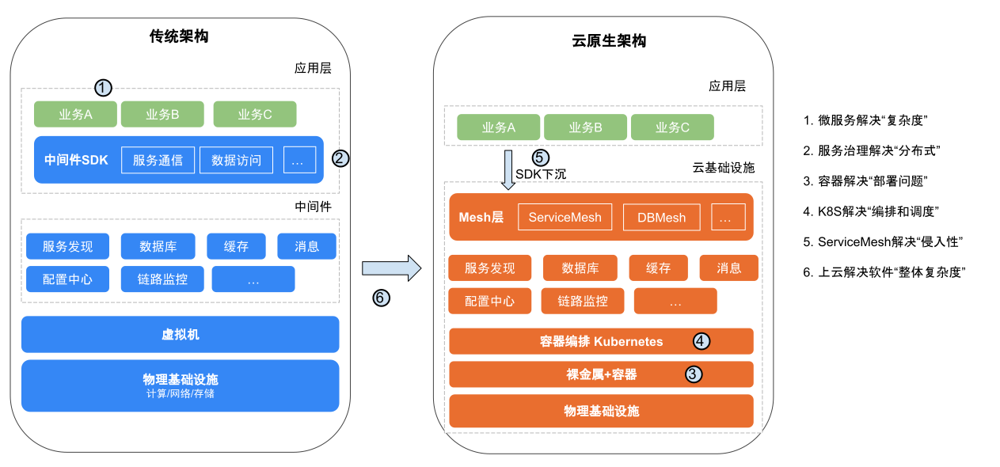

    
<small style={{color: '#cccccc'}}>last modified at December 7, 2023 16:56</small>
# Cloud Native

## 为什么上云

按照规模和变更速度将软件企业分为 4 个象限

* 传统企业，规模相对较小，短时间变化慢，问题范围相对有限
* 电信级别，规模很大，短时间软硬件变化慢，主要面对硬件级别故障
* 初创公司，规模小，变化快，面对软件问题较多
* 规模庞大的以互联网业务为主的企业，规模大，短时间变化快，面对的 IT 问题复杂

互联网时代，能快速成长的公司具有：

* 快速变更，不断创新的业务
* 提供可靠的服务，可因应可能的错误和故障
* 弹性的系统架构，适应快速增长的用户规模

云原生是为了适应上面的需求而产生，因此它具有：

- 可用，提供高可用的的应用服务
- 弹性，适应不同的应用规模，动态部署资源
- 敏捷，快速变更，适应业务需求的变化
- 成本，成本可控，更有效地利用资源

## 什么是云原生

### Pivotal 的定义

最初版本：

- 符合 12 因素应用
- 面向微服务
- 自服务敏捷架构
- 基于 API
- 抗脆弱性

更新版本：

- 模块化，通过微服务
- 可观测
- 可部署
- 可测试
- 可处理
- 可替换

目前版本：

- DevOps
- CI/CD
- 微服务
- 容器化

### CNCF 的定义

初版：

- 应用容器化
- 面向微服务
- 动态调度（可编排）

新版 v1.0：

- 容器
- 服务网格
- 微服务
- 不可变的基础设施
- 声明式 API

通过以上基础构建容错性好、易于管理和便于观察的松耦合系统。结合可靠的自动化手段，使工程师可更容易对系统做出频繁和可预测的重大改变。

## 代表技术

### 容器技术

Docker and k8s

### 微服务

Loosely Coupled and Bounded Contexts

技术挑战

- 服务发现
- 服务熔断
- 负载均衡
- 通讯安全

### 服务网格 Service Mesh

是一个处理服务通讯的专门的基础设施，它的职责是由云原生应用组成服务的复杂拓扑结构下进行可靠的请求传送。在实践中，它是一组和应用服务部署在一起的轻量级的网络代理，对应用服务透明。

由两部分组成：

- 数据平面（Data Plane），轻量级代理，负责协调和控制服务间的通讯和流量
- 控制平面（Control Plane），配置和管理数据平面，提供服务发现、智能路由、流量控制、安全控制

**Sidecar 模式**

通过劫持发送到应用容器的流量从而实现对流量的控制。

缺点：（对于性能敏感或部署规模很大的应用服务）
- 增加延迟
- 增加资源占用

**Proxyless 模式**

对通讯协议进行扩充（例如 gRPC），使其具有流量控制的能力，和应用同属一个进程。实质是传统的 SDK。

**Sidecarless 模式**

对内核进行扩充，使其具有流控能力。

**Ambient Mesh 模式**

“中心化代理模式”，通过共享和中心化的代理进行流量控制，代替 sidecar。

### 不可变的基础设施

可变的基础设施，可以手动对当前实例进行变更（例如安装或卸载某些组件）；在集群规模上，带来不同实例基础设施的不一致，导致类似并发修改导致的数据不一致风险。

不可变的基础设施，实力一旦创建之后就变成只读状态，如需修改，只能使用新实例进行替换。最大优势是一致性，方便快速地弹性扩缩容、升级、回滚等操作。

### 声明式设计

### DevOps

开发与运维的协作

## 传统架构与云原生架构对比

从单个微服务来看，自身复杂度降低了，有“强大底层系统”的支撑。

但从整个系统的角度，复杂度并没有减少和消失，只是将底层系统的复杂度交给云基础设施。

## 对架构师的要求

- 容器和镜像：Docker、containerd、CRI-O、Kata Containers
- 镜像仓库：Harbor、Nydus
- 应用封装：Kustomize、Helm
- 持续集成：Gitlab、Tekton
- 持续部署：FluxCD、argoCD
- 容器编排：Kubernetes
- 网关：Ingress-Nginx、APISIX
- 日志：Fluentd、Grafana loki
- 监控：Grafana、Prometheus
- 应用开发：Nocalhost

      