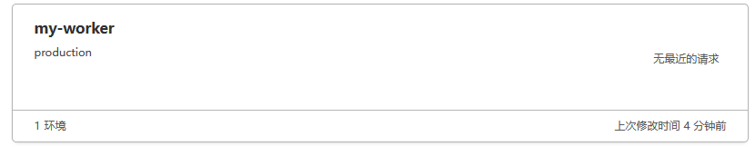
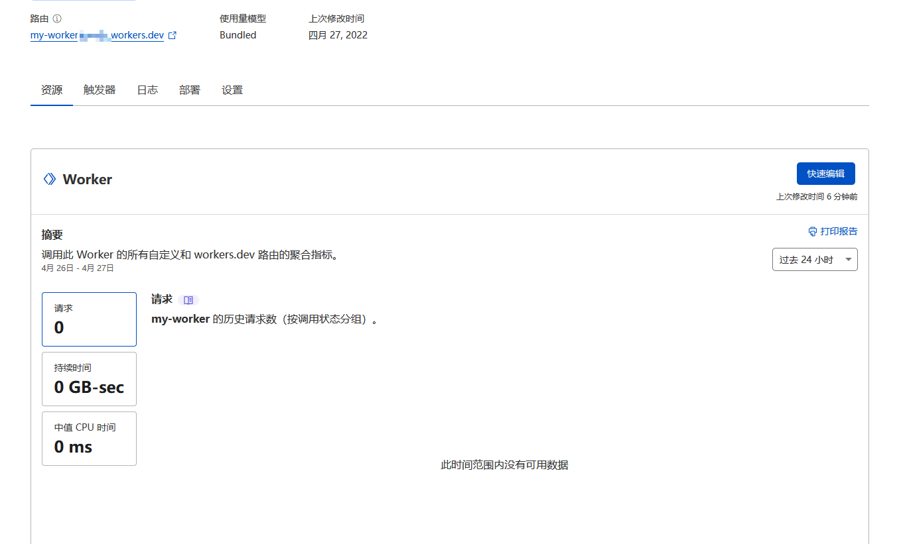

    
<small style={{color: '#cccccc'}}>last modified at December 7, 2023 08:56 AM</small>
# Cloudflare Workers

Cloudflare Workers provides a serverless execution environment that allows you to create entirely new applications or augment existing ones without configuring or maintaining infrastructure.

## Wrangler-CLI

`Wrangler-CLI` 是 Cloudflare Workers 的命令行工具，提供了一个简单的接口，可以让你在本地开发环境中使用 Cloudflare Workers。

这样我们就可以在本地进行开发，不需要上传到服务端。

### 安装

使用 NPM

```sh
npm i @cloudflare/wrangler -g
```

使用 Yarn

```sh
yarn global add @cloudflare/wrangler
```

### 授权

安装之后，需要授权才可正常使用 `Wrangler-CLI`。

在授权之前，先确保有 Cloudflare 的账号，没有的可以去[官网](https://www.cloudflare.com/)注册。

有账号之后，可以在命令行中输入下面命令来登录。

```sh
wrangler login
```

会尝试使用系统默认浏览器打开登陆页面，如何没有弹出浏览器，可以复制命令行输出的一串登陆链接，然后手动打开。

打开登陆页面后，输入账号密码即可完成授权。

## 创建新项目

创建默认模板的新项目

```sh
wrangler generate my-worker
```

会自动创建一个新的项目，并且会在当前目录下生成一个新的文件夹，文件夹名称为 `my-worker`。

项目目录结构如下：

```text
.cargo-ok
.gitignore
.prettierrc
CODE_OF_CONDUCT.md
index.js # 入口文件
LICENSE_APACHE
LICENSE_MIT
package.json
README.md
wrangler.toml # 配置文件
```

和普通前端项目的最大不同是多了个 `wrangler.toml` 文件，这个文件是用来配置 Cloudflare Worker 的。

## 配置项目

打开 `wrangler.toml` 文件，可以看到配置项目的内容如下：

```toml
name = "my-worker" // 项目名称，必须填写，会作为域名的前缀
type = "javascript" // 项目类型，必须填写，可选值为 `javascript` 或 `webpack` 或 `rust`

account_id = "" // 账户 ID，可以在 dashboard 中的 worker 页面查看
workers_dev = true // 是否发布到已申请的 [subdomain].worker.dev 域名，不写默认为 false
route = "" // fetch 触发器的路由，不写默认为 `/`
zone_id = ""
compatibility_date = "2022-04-27"
```

## 启动项目

看完基本配置后，可以在命令行中运行下面命令来进行调试：

```sh
wrangler dev
```

需要连接 Cloudflare Workers 的服务器，国内启动可能失败，多试几次。

启动成功会看到如下输出：

```sh
 watching "./"
 Listening on http://127.0.0.1:8787
```

打开浏览器输入 `http://127.0.0.1:8787/` 即可看到项目的输出。

## 发布项目

当项目开发完成之后，通过命令行进行发布：

```sh
wrangler publish
```

会自动上传到 Cloudflare Workers 的服务器，如果服务不存在则会自动创建。

发布成功后，会在命令行输出如下信息：

```sh
 Basic JavaScript project found. Skipping unnecessary build!
 Successfully published your script to
 https://my-worker.[subdomain].workers.dev
```



点击可以看到详情



## 总结

Cloudflare 虽然提供了线上调试的环境，但本地开发还可以结合 `Webpack`，`Lerna` 等工具进行更复杂的开发，从而实现更强大的功能。

参考资料:

- [官网文档](https://developers.cloudflare.com/workers/)

      