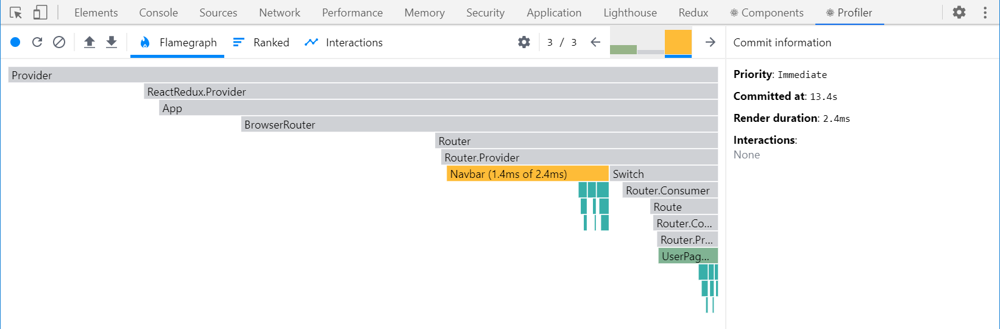

    
<small style={{color: '#cccccc'}}>last modified at December 8, 2023 7:10 AM</small>
# Redux Tutorial

Redux is a predictable state container for JS Apps.

- predictable
- centralized
- debuggable
- flexible

> The whole global state of your app is stored in _an object tree_ inside _a single store_. The only way to change the state tree is to _create an action_, an object describing what happen, and _dispatch_ it to the store. To specify how state gets update in response to an action, you write pure _reducer_ functions that calculate a new state based on the old state and the action.

## Core Concepts

### _State_

A single centralized place to store the global state in the app, and specific patterns to follow updating that state to make the change predictable.

### _Store_

An object that state lives in, has a method called `getState` that returns the current state.

The store has a method called `Dispatch`, the only way to update the state, `store.dispatch(action)`

`Selectors` are functions that know how to extract specific pieces from the store.

### _Reducer_

You can think of a reducer as an event listener which handles events based on the received action.

It receives the current state and an action, decides how to update the state if necessary, and returns the new state.

`(state, action) => newState`, it should be a pure function.

### _Action_

You can think of an action as an event that describes something that happened in the app.

The `action creator` always creates and returns an action object.

```ts
// Flux Standard Action (FSA)

type FSAction = {
  type: string;
  payload?: any;
  error?: boolean;
  meta?: any;
}
```

## Data Flow

### _one-way data flow_

- State describes the condition of the app at a specific point in time
- The UI is rendered based on that state
- When something happens, the state is updated based on what occurred
- The UI re-renders based on that new state 


One way extracts the shared state from the components, and put it into a centralized location outside the component tree. With this, our component tree becomes a big 'view', and any component can access the shared state and trigger actions. 

Redux actions and state should only contain **plain JS object**. **Do not** put class instance, functions or other **non-serializable** values into.

### _immutability_

### Immer

[Immer](https://immerjs.github.io/immer/) is a tiny package that allow you to work with immutable state in a convenient way.

## Middleware

- Execute extra logic when any action is dispatched
- Pause, modify, delay, replace or halt dispatched actions
- Write extra code that has access to `dispatch` and `getState`
- Teach `dispatch` how to obtain values besides the plain action objects, such as functions and promises, by intercepting them and dispatching real action object inst

### Custom Middleware

```js
function exampleMiddleware(storeAPI: { dispatch, getState }) {
  return function wrapDispatch(next) {
    return function handleAction(action) {
      // do something ...
      next(action)
    }
  }
}
```

- `exampleMiddleware` is the middleware itself which will be called by `applyMiddleware`
- The argument `next` is actually the next middleware in the pipeline, if this middleware is the last one, then `next` is actually the original `store.dispatch`
- The inner function `handleAction` will actually do something

## Async Logic and Data Fetching


> Any asynchronicity has to happen outside of store.

### Thunk Functions

> The word "thunk" is a programming term that means "a piece of code that does some delayed work".

```js
const thunkMiddleware = ({dispatch, getState}) => {
  return (next) => {
    return (action) => {
      if (typeof action === 'function') {
        return action(dispatch, getState)
      }
      return next(action)
    }
  }
}
```

### Data Fetching

Data fetching logic for Redux typically follows a predictable pattern:

- start: a "start" action is dispatched before the request, to indicate that the request is in progress. This may be used to track loading state.
- request made: the request is made.
- done(success/failure): depending on the request response, the async logic dispatches either a "success" action or a "failure" action. The reducer logic clears the loading state in both cases and either processes the result data from the success case or stores the error from the failure case for potential display.

RTK's `createAsyncThunk` API generates thunks that automatically dispatch those 'start/success/failure' actions for you. It accepts two arguments:

- a string that will be used as the prefix for the generated action types
- a `payload creator` callback function that should return a Promise containing some data while success, or an error while failure.

There are times when a slice reducer needs to respond to other actions that were not defined as part of the slice reducers field. We can do that using the slice `extraReducers` field instead.

The extraReducer option should be a function that receives a parameter called `builder`. The builder object let us define additional case reducers that will run in response to actions defined outside of slice

- `builder.addCase(actionCreator, reducer)`, handles an specific action based on an action creator or a plain action type string.
- `builder.addMatcher(matcher, reducer)`, handles a series of actions that action where the matcher function returns true
- `builder.addDefaultCase(reducer)`, default reducer while there is no any reducer that matches the action creator and a plain action type string.

_You can chain these together, if multiple matcher match the action, they will run in the order they were defined._

## Performance and Normalizing Data

> React's default behavior is that when a parent component re-renders, React will recursively render all child component inside of it!

### Investigating Render Behavior

We can use the React DevTools Profiler to view some graphs of what components are re-render while state is updated.



We know that `useSelector` will re-run every time an action is dispatched, and that it forces the component to re-render if return a new reference value.

### Memorizing Selector

[Reselect](https://github.com/reduxjs/reselect) is a library for creating memorized selector functions, and was specifically designed to be used with Redux.

`createSelector` function in Reselect is used for generating memorized selectors that will only recalculate results when the inputs change.

```js
export const selectAll = state => state.data

export const selectByUser = createSelector(
  [selectAll, (state, userId) => userId], // deps
  (data, userId) => data.filter(d => d.userId === userId) // selector
)
```

_If we try calling `selectByUser` multiple times, it will only re-run the output selector while either post and userId has changed._

### Normalizing Data

_"Normalization" is a process way to look up a **single** item based on its ID, directly, without having to check all the other items._

in Redux, normalized state means that:

- We only have one copy of each particular piece of data in our state, so there is no duplication.
- Data that has been normalized is kept in the lookup table, where the item IDs are the keys, and the items themselves are the values.
- There may also be an array of all of the IDs for a particular item type.

The lookup table looks like:

```js
{
  user: {
    ids: ['user1', 'user2', 'user3'],
    entities: {
      'user1': { id: 'user1', name: 'test1' },
      'user2': { id: 'user2', name: 'test2' },
      'user3': { id: 'user3', name: 'test3' },
    }
  }
}
```
This makes it easy to find a particular user object by its ID, without having to look through all the other object in the array.

`createEntityAdapter` provides a standardized way to store your data in slice by taking a collection of items and putting them into the shape of `{ ids: [], entities: {} }`. Along with this predefined state shape, it generates a set of reducer of functions and selectors that know how to work with the data.

`createEntityAdapter` accepts a sortComparer function as its input params which will be used to keep the ids array in sorted order.

The adapter object has:

- `getSelectors`, you can pass in a selector that returns this particular slice of state from root state, and it will generate selector like `selectAll` and `selectById`.
- `getInitialState`, generates an empty lookup table, and it accepts more fields that will be merged in. 

## miniReduxStoreExample

```js
function createStore(reducer, initialState) {
  let state = initialState;
  const listeners = [];

  function subscribe(listener) {
    listeners.push(listener);
    return function unsubscribe() {
      const index = listeners.indexOf(listener);
      listeners.splice(index, 1);
    }
  }

  function dispatch(action) {
    state = reducer(state, action);
    listeners.forEach((listener) => {
      listener(getState)
    })
  }

  function getState() {
    return state;
  }

  dispatch({ type: '@@redux/INIT' });

  return { subscribe, dispatch, getState };
}
```

## Work with React

Using Redux with any UI layer requires a few consistent steps:

1. Create a Redux store
2. Subscribe to updates
3. Inside the subscription callback:
  - Get the current store state
  - Extract the data needed by this piece UI
  - Update the UI with the data
4. If necessary, render the UI with initial state
5. Respond to UI inputs by dispatching Redux actions

**Reference**

[Redux - Complete Tutorial by Cosden Solutions](https://www.youtube.com/watch?v=5yEG6GhoJBs)

[Redux Official](https://redux.js.org/introduction/getting-started)
      