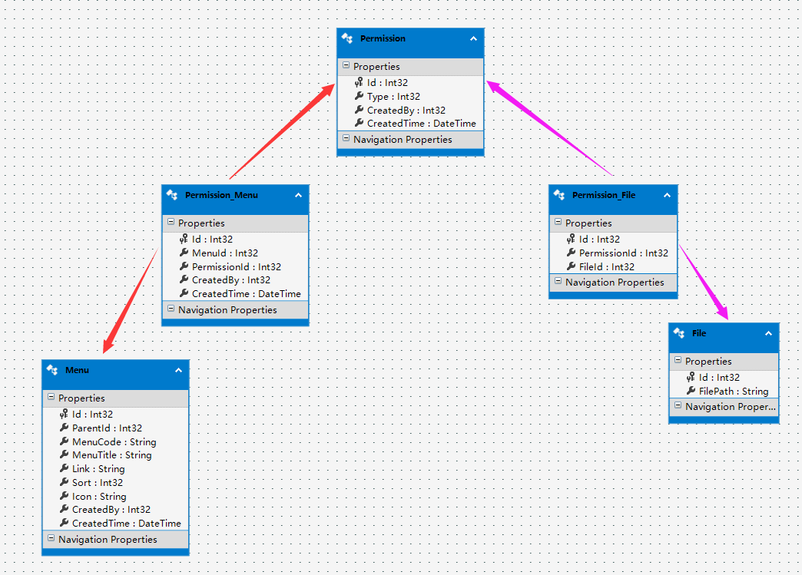
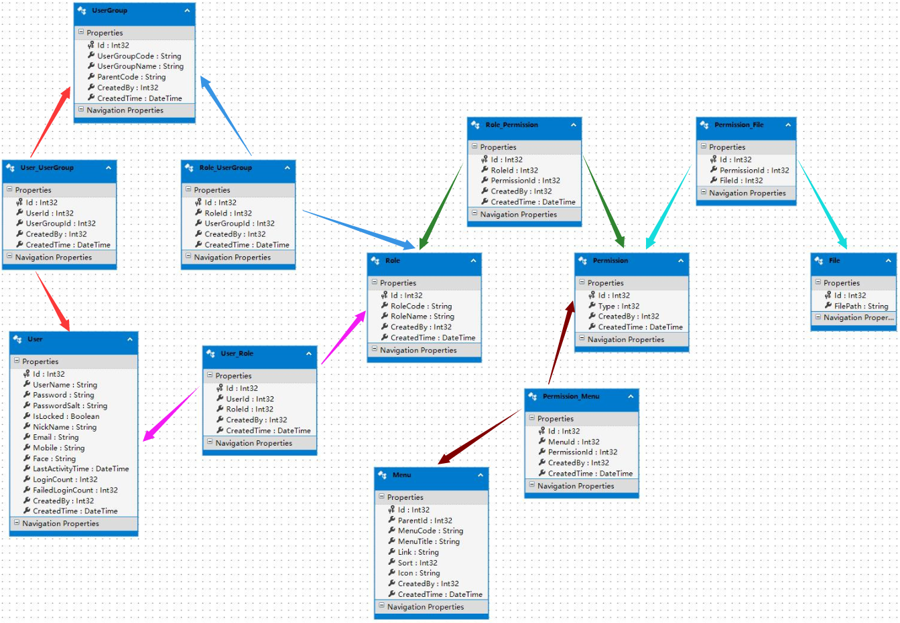

    
# RBAC

Role Based Access Control, 基于角色的访问控制。

> 权限系统的本质是对用户可访问系统资源的控制

## 最简单的权限模型

> 需求：能给用户赋予数据的增、删、改、查权限

分析：权限的主体是用户，用户 - 权限的关系为 M - M

用户表 Users

| 字段 | 类型 | 备注 |
| :- | :- | :- |
| id | int | user id |
| name | varchar | user name |

权限表 Permissions

| 字段 | 类型 | 备注 |
| :- | :- | :- |
| id | int | permission id |
| permission | varchar | permission description |

权限枚举

```ts
enum Permission {
  add: 1, // 2^0 = 0001
  update: 2, // 2^1 = 0010
  delete: 4, // 2^2 = 0100
  select: 8 // 2^3 = 1000
}
```

用户 - 权限关联表 UsePermissions

| 字段 | 类型 | 备注 |
| :- | :- | :- |
| userId | int | user id |
| permissionId | int | permission id |

假如一个用户具有增、改权限，关联表存储为 1 -> 1, 1 -> 2

于是对于权限有两种基本操作

- 授权，INSERT 关联表
- 鉴权，EXISTS userId==传入用户ID and Permission是否包含所需的值

为了简化关联表的存储，Permission 的枚举使用了 2 的幂运算值。

关联表可以存储为 1 -> ( 1|8 ) = 9， 判断权限可以 9 & 4 === 4 ? 'yes': 'no'

- 授权，按位或，叠加权限
- 鉴权，按位与，是否含有所需权限

## 基于角色的基本权限控制

> 新需求：满足一类职位的用户拥有相同的权限

角色表 Roles

| 字段 | 类型 | 备注 |
| :- | :- | :- |
| id | int | role id |
| role | varchar | role name |

约定：

- 权限操作的对象从**用户**变为**角色**
- 不对单一用户操作权限，仅对角色操作权限。每个用户至少拥有一个角色

角色 - 用户的抽象关系为 M - M

用户 - 角色关联表

| 字段 | 类型 | 备注 |
| :- | :- | :- |
| userId | int | user id |
| roleId | int | role id |

角色 - 权限关联表

| 字段 | 类型 | 备注 |
| :- | :- | :- |
| roleId | int | role id |
| permissionId | int | role name |

总结操作流程：

- 授权，给角色添加权限，给用户添加角色
- 鉴权，取出用户所有角色，取所有角色权限的并集，判断是否含有所需权限

## 基于角色并含有用户组的权限控制

> 新需求：所有部门的开发岗位有相同的增、查权限

在上一节的基础上，可以给所有开发岗位同事添加相同角色，缺点：

- 系统没有部门的对应抽象
- 一旦某个部门的同事权限有变化，可能需要新建角色，重新授权

引入**用户组**，可以对应公司的部门、小组、团队等

用户组表

| 字段 | 类型 | 备注 |
| :- | :- | :- |
| id | int | user group id |
| userGroup | varchar | user group name |
| parentId | int | parent user group id |

约定：

- 用户可以拥有角色，用户组也可以拥有角色
- 权限的操作依然仅限于角色，不可对用户、用户组进行操作

用户 - 用户组的关系为 M - M

一个人可以在多个部门、多个团队、多个项目

用户 - 用户组关联表

| 字段 | 类型 | 备注 |
| :- | :- | :- |
| userId | int | user id |
| userGroupId | id | user group id |

用户组 - 角色关联表

| 字段 | 类型 | 备注 |
| :- | :- | :- |
| userGroupId | id | user group id |
| roleId | int | role id |

## 扩展对更多权限的支持

> 问题：目前仅支持单一权限，当需要多元权限控制时不支持。例如：菜单相关权限、文件相关权限

思路：对各种权限对象进行抽象，将其转换为一元权限控制

如下图：



整体结构




<div style={{textAlign: 'right'}}><small style={{color: 'grey'}}>last modified at December 6, 2023 16:49</small></div>
      